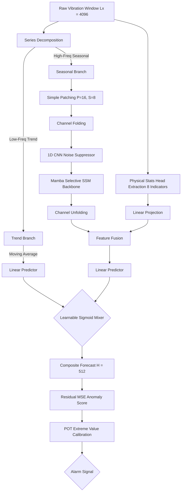

# Hybrid Mamba-CNN Architecture with Physics-Informed Stats Head for Leakage-Free Bearing Anomaly Detection

[](https://arxiv.org/abs/2312.00752)
[](https://opensource.org/licenses/MIT)
[](https://pytorch.org)
[](https://github.com/state-spaces/mamba)

This repository contains the official implementation of the **Hybrid Mamba-CNN** architecture with a **Physics-Informed Statistical Head**, optimized for unsupervised, leakage-free bearing anomaly detection in run-to-failure lifecycles.

---

## 📌 Abstract & Research Contributions

In industrial diagnostics, traditional self-attention mechanisms introduce a quadratic computational bottleneck $\mathcal{O}(N^2)$ and are susceptible to noise dispersion under non-stationary vibration signals, often masking weak, chôm-lỗi fault signatures. Conversely, standard deep forecasting models suffer from data leakage during threshold calibration or lack mechanical interpretability. 

To resolve these challenges, we propose a **Physics-Informed, Series-Decomposed Hybrid Mamba-CNN forecasting framework** for unsupervised and leakage-free bearing anomaly detection.



### 🌟 Key Contributions:
1. **Unsupervised Self-Supervised Forecasting**: Learns bearing degradation patterns without requiring explicit failure labels or manual degradation-stage segmentation.
2. **Channel-Independent Hybrid Mamba-CNN**: Combines the local noise-suppression capabilities of 1D Convolutional layers with the linear-time complexity $\mathcal{O}(N)$ selective scan mechanism ($\text{S}6$) of Mamba for handling long lookback windows ($L_x = 4096$).
3. **Physics-Informed Statistical Head**: Stabilizes latent representations and improves mechanical interpretability by fusing $8$ time-domain indicators (e.g., *Kurtosis* for transient micro-cracks and *RMS* for total wear energy) directly into the forecasting head.
4. **Leakage-Free Validation Protocol**: Establishes dynamic decision thresholds using Peak Over Threshold (POT) calibration based on Extreme Value Theory, computed strictly from early-stage healthy operational segments to prevent information leakage.

---

## 📚 Codebase & Technical Navigation

We have reorganized our documentation to keep the repository root clean. Detailed reference guides are available under the `docs/` folder:

*   📖 **[User & Run Guide (Tiếng Việt / English)](file:///f:/APPS_PJ/mamba-forecast-ad/docs/user_guide.md)**: Virtual environment setup, PyTorch & GPU configuration, automatic dataset downloading from Hugging Face Hub, and step-by-step training/evaluation commands.
*   🛠️ **[Technical & Mathematical Reference](file:///f:/APPS_PJ/mamba-forecast-ad/docs/technical_reference.md)**: Details on the data preprocessing pipeline, sliding window configurations, detailed mathematical formulations for all model components, and anomaly scoring logic.
*   📋 **[Q1 Peer Review Checklist](file:///f:/APPS_PJ/mamba-forecast-ad/docs/review_guide_Q1.md)**: Internal guidelines, manuscript writing recommendations, and review checklists for Q1-tier journal readiness.

---

## 📊 Experimental Results

Experimental evaluations were conducted on the Paderborn University (UPB) bearing dataset under stationary load conditions. Benchmark models were synchronised to a strict **parameter budget parity (~338k parameters)** using the automated baseline scaling protocol.

### 1. Macro-Average Anomaly Detection Performance
The anomaly detection performance was evaluated under localized **Peak Over Threshold (POT)** calibration ($q=10^{-3}$) and **Robust Thresholding** (based on Interquartile Range):

| Model | Batch Size | Val MSE | Val MAE | Test MSE | Test MAE | F1 (Robust) | FAR (Robust) | F1 (POT) | FAR (POT) |
| :--- | :---: | :---: | :---: | :---: | :---: | :---: | :---: | :---: | :---: |
| LSTM | 64 | 0.7505 | 0.6439 | 4.4386 | 1.2215 | 0.8905 | **0.0112** | 0.6888 | **0.0011** |
| Simple-Mamba | 64 | <u>0.5243</u> | <u>0.5194</u> | 4.6807 | 1.1521 | **0.9155** | 0.0129 | 0.6559 | **0.0011** |
| PatchTST | 64 | **0.4993** | **0.5058** | <u>4.2575</u> | **1.1282** | **0.9156** | 0.0126 | **0.7649** | **0.0011** |
| **Mamba-Hybrid** | **1024** | 0.5778 | 0.5538 | **4.2488** | <u>1.1448</u> | 0.9048 | **0.0112** | <u>0.7565</u> | **0.0011** |

> [!NOTE]
> Mamba-Hybrid (BS=1024) achieves the lowest forecasting test error (MSE = 4.2488) and the second-best F1-score (75.65%) under the leakage-free POT calibration, while keeping the false alarm rate (FAR) at a highly conservative 0.11%.

### 2. Edge Suitability: Peak VRAM & Inference Latency
Resource usage and per-sample latency profiles were evaluated on an NVIDIA Tesla T4 GPU under batched inference workloads:

| Model | Batch Size (BS) | Peak VRAM (MB) | Total Latency (ms/sample) | Inference Latency (ms/sample) |
| :--- | :---: | :---: | :---: | :---: |
| LSTM | 64 | **145.9** | 14.1804 | 14.1646 |
| Simple-Mamba | 64 | 2023.3 | 5.6823 | 5.6641 |
| PatchTST | 64 | 1335.4 | <u>2.0576</u> | <u>2.0382</u> |
| **Mamba-Hybrid** | **64** | <u>215.9</u> | 3.9426 | 3.9245 |
| **Mamba-Hybrid** | **1024** | 3253.6 | **1.0086** | **0.9973** |

*   **VRAM Efficiency**: At $BS=64$, Mamba-Hybrid requires only **215.9 MB** of VRAM, showing an **83.8%** and **89.3%** VRAM reduction compared to PatchTST (1335.4 MB) and Simple-Mamba (2023.3 MB), respectively.
*   **Throughput Scalability**: At $BS=1024$, Mamba-Hybrid achieves a per-sample latency of **1.01 ms** ($3.9\times$ throughput speedup), outperforming LSTM, Simple-Mamba, and PatchTST by $14.1\times$, $5.6\times$, and $2.0\times$, respectively, avoiding the quadratic memory explosion of PatchTST attention layers.

### 3. Quantitative Ablation Study
We evaluated the contribution of each component under parameter budget parity (~200k params) across bearings B01–B05:
*   **Variant 1 (SimpleMamba)**: Mamba applied directly to raw signals.
*   **Variant 2 (MambaDecomp)**: Adds temporal Series Decomposition.
*   **Variant 3 (MambaDecomp\_P16\_S8)**: Adds Patch Embedding ($P=16, S=8$).
*   **Variant 4 (MambaCNN\_Decomp / Proposed)**: Fuses 1D CNN block prior to selective scan.

| Model Variant | Val MSE | Val MAE | Test MSE | Test MAE | F1 (POT) | VRAM Train (MB) | VRAM Inference (MB) | Train Time/Epoch (s) | Latency (ms/sample) |
| :--- | :---: | :---: | :---: | :---: | :---: | :---: | :---: | :---: | :---: |
| **Variant 1** | 0.3800 | 0.4226 | 3.2838 | 0.9201 | 0.9350 | 2859.10 | 573.94 | 189.74 | 1.0571 |
| **Variant 2** | 0.3211 | 0.3871 | 3.2066 | 0.9039 | 0.9419 | 2859.27 | 575.51 | 217.12 | 1.0226 |
| **Variant 3** | **0.2837** | **0.3623** | 3.2302 | <u>0.8978</u> | **0.9445** | **394.83** | **95.81** | **43.41** | <u>0.1832</u> |
| **Variant 4** | <u>0.3108</u> | <u>0.3813</u> | **3.1454** | **0.8946** | <u>0.9394</u> | <u>403.85</u> | <u>102.76</u> | <u>47.27</u> | **0.1651** |

> [!TIP]
> *   Integrating **Series Decomposition** improves F1-Score from 93.50% to 94.19%.
> *   Adding **Patch Embeddings** compresses sequences, resulting in an **86.2%** training VRAM reduction (from 2859 MB to 394 MB) and accelerating epoch training time by $5.0\times$ (from 217 s to 43 s).
> *   Fusing the **1D CNN block** minimizes Test MSE to 3.1454 and MAE to 0.8946 while achieving the lowest system latency of 0.1651 ms.

### 4. Threshold Calibration Calibration Latency
To support online self-calibration, the Peak Over Threshold (POT) algorithm is highly efficient compared to other baseline methods:
*   **3-Sigma Thresholding**: ~0.20 ms
*   **POT Thresholding (Ours)**: **23.51 ms** (Fastest EVT method)
*   **Gaussian Mixture Models (GMM)**: 1248.05 ms ($53\times$ slower than POT)
*   **Optimal Threshold Search (Global)**: 7597.00 ms ($323\times$ slower than POT)

---

## ⚡ Quick Start

### 1. Setup Environment
```bash
python -m venv venv
source venv/bin/activate  # venv\Scripts\activate on Windows
pip install mamba-ssm --no-build-isolation
pip install -r requirements.txt
```

### 2. Run Training
```bash
python src/training/train.py --config configs/mamba_ts.yaml --model Mamba1-Hybrid
```

### 3. Run Evaluation
```bash
python src/training/eval.py --config configs/mamba_ts.yaml --model_type Mamba1-Hybrid --model_path results/models/mamba1_hybrid_best.pth
```

For detailed execution and YAML descriptions, please refer to the **[User & Run Guide](file:///f:/APPS_PJ/mamba-forecast-ad/docs/user_guide.md)**.

---

## 🤝 Acknowledgements
We acknowledge Nguyen Tat Thanh University, Ho Chi Minh City, Vietnam, and the Faculty of Software Engineering, FPT University, Ho Chi Minh City, Vietnam, for supporting this study.