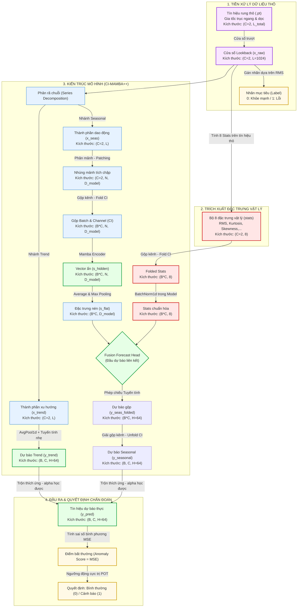

# Sơ đồ Luồng Dữ liệu và Định hướng Phát triển Kiến trúc CI-Mamba++

Tài liệu này trình bày trực quan và chi tiết quy trình xử lý dữ liệu hiện tại từ tín hiệu rung thô đến đầu ra cảnh báo, đồng thời đề xuất các hướng phát triển nâng cao (Physics-Informed & Domain Adaptation) để tối ưu hóa mô hình phục vụ báo cáo khoa học.

---

## 1. Sơ đồ Luồng Dữ liệu Hiện tại (Current Data Flow)

Sơ đồ dưới đây mô tả quá trình xử lý tín hiệu rung thô trực tiếp (không qua chuẩn hóa Z-score tín hiệu hay RevIN), tính toán các đặc trưng vật lý tĩnh, phân tách chuỗi thời gian, huấn luyện mạng Mamba kênh độc lập (Channel-Independent), dung hợp đặc trưng vật lý tại đầu ra và đưa ra quyết định cảnh báo thông qua thuật toán POT (Peak-Over-Threshold).

### 1.1. Công thức Toán học của bộ 8 chỉ số vật lý (`stats`)
Được tính toán trực tiếp trên tín hiệu rung thô chưa chuẩn hóa $x \in \mathbb{R}^{L}$:
1. **Mean (Trung bình):**
   $$\mu = \frac{1}{L} \sum_{i=1}^L x_i$$
2. **Standard Deviation (Độ lệch chuẩn):**
   $$\sigma = \sqrt{\frac{1}{L} \sum_{i=1}^L (x_i - \mu)^2} + \epsilon$$
3. **RMS (Trị hiệu dụng):**
   $$\text{RMS} = \sqrt{\frac{1}{L} \sum_{i=1}^L x_i^2}$$
4. **Peak-to-Peak (Đỉnh - Đỉnh):**
   $$X_{p-p} = \max(x) - \min(x)$$
5. **Skewness (Độ bất đối xứng):**
   $$\text{Skewness} = \frac{1}{L} \sum_{i=1}^L \left(\frac{x_i - \mu}{\sigma}\right)^3$$
6. **Kurtosis (Độ nhọn):**
   $$\text{Kurtosis} = \frac{1}{L} \sum_{i=1}^L \left(\frac{x_i - \mu}{\sigma}\right)^4$$
7. **Crest Factor (Hệ số đỉnh):**
   $$C_f = \frac{\max(|x|)}{\text{RMS} + \epsilon}$$
8. **Shape Factor (Hệ số dạng):**
   $$S_f = \frac{\text{RMS}}{\frac{1}{L} \sum_{i=1}^L |x_i| + \epsilon}$$

*(Trong đó $\epsilon = 10^{-8}$ để đảm bảo an toàn số học).*

---

## 2. Ảnh hưởng của Điều kiện Vận hành (Operating Conditions)

Mặc dù các chỉ số thống kê trên không trực tiếp nhận tốc độ quay hay tải trọng làm tham số đầu vào trong công thức cơ bản, giá trị của chúng **phụ thuộc gián tiếp rất mạnh vào điều kiện vận hành**:
*   **Khi Tốc độ (Speed) / Tải trọng (Load) tăng:** Rung động cơ học của hệ thống tăng $\to$ Biên độ tín hiệu $x$ tăng vọt $\to$ Làm tăng các chỉ số biên độ tuyệt đối như **RMS, Peak-to-Peak, Std**.
*   **Cách khắc phục sự dịch chuyển phân phối:** Trong pipeline thực nghiệm, thuật toán **POT (Peak-Over-Threshold)** được áp dụng để tự động hiệu chuẩn ngưỡng động một cách độc lập cho từng vòng bi (tương ứng với từng ca vận hành riêng biệt) dựa trên tập điểm MSE lành mạnh (Healthy Scores) thu được ở giai đoạn đầu chu kỳ của vòng bi đó (khoảng 40% dữ liệu đầu theo cấu hình `train_ratio: 0.4`). Phương pháp hiệu chuẩn cục bộ (Local Calibration) này giúp triệt tiêu ảnh hưởng trôi biên độ do thay đổi điều kiện vận hành mà không cần nhúng trực tiếp vector điều kiện vận hành $oc$ vào mô hình HybridMamba. Vector điều kiện vận hành $oc$ được trích xuất trong tập dữ liệu thực tế chỉ dùng làm đầu vào so sánh cho mô hình baseline đối chứng (`MambaTSOfficial`).

---