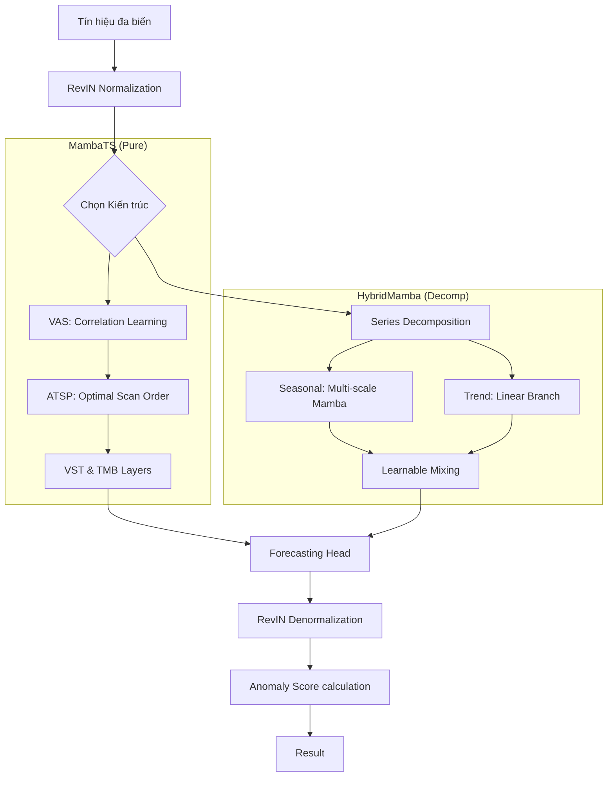

# MambaTS: Quy trình Chẩn đoán và Dự báo dựa trên Selective SSM cải tiến (arXiv:2405.16440)

Tài liệu này mô tả chi tiết 3 quy trình (Pipeline) cốt lõi của hệ thống chẩn đoán lỗi vòng bi dựa trên kiến trúc **MambaTS**.

---

## 1. Pipeline Tổng quát (End-to-End Project Pipeline)

Quy trình từ dữ liệu thô đến khi ra báo cáo hiệu năng cuối cùng.

### Bước 1: Chuẩn bị và Tiền xử lý dữ liệu
- **Đọc dữ liệu thô**: Tải các file `.mat` từ bộ dữ liệu B02.
- **Chuyển đổi đơn vị**: Áp dụng hệ số 10 g/V để đưa tín hiệu về đơn vị gia tốc vật lý.
- **Lưu trữ Tensor**: Lưu dữ liệu dưới dạng `.pt` để tối ưu tốc độ đọc/ghi trong PyTorch.
- **Phân tách dữ liệu (Chiến lược 10/50/40)**:
    - **Skip (10%)**: Loại bỏ giai đoạn chạy rà (break-in) ban đầu. Giai đoạn này người vận hành chưa tăng tải trọng nên tín hiệu chưa ổn định.
    - **Train/Val (50%)**: Sử dụng một phần dữ liệu ở trạng thái khỏe mạnh để huấn luyện mô hình dự báo và tinh chỉnh ngưỡng. Lấy theo tỉ lệ để đảm bảo tính đại diện của dữ liệu, không lấy theo thứ tự thời gian liên tục.
    - **Test (40%)**: Bao gồm phần dữ liệu khỏe mạnh còn lại và toàn bộ giai đoạn suy giảm/lỗi để đánh giá khả năng phát hiện.

### Bước 2: Huấn luyện mô hình (Forecasting Task)
- **Mục tiêu**: Huấn luyện MambaTS và Mamba-Hybrid để dự báo tín hiệu tương lai (Horizon) từ dữ liệu quá khứ (Lookback).
- **Loss Function**: Sử dụng MSE hoặc MAE để cực tiểu hóa sai số giữa tín hiệu thực và dự báo.
- **Validation**: Theo dõi lỗi trên tập Val để chọn checkpoint tốt nhất, tránh overfitting.

### Bước 3: Hiệu chuẩn hệ thống phát hiện bất thường
- **Tính toán sai số**: Chạy mô hình trên toàn bộ tập Val/Healthy để lấy phân phối sai số (Anomaly Scores).
- **Tối ưu hóa ngưỡng**: Sử dụng các mô hình thống kê (POT, GMM, hoặc 3-Sigma) để tìm ra ngưỡng cảnh báo tự động.

### Bước 4: Kiểm thử và Đánh giá
- **Inference**: Chạy mô hình trên tập Test để lấy điểm số bất thường theo thời gian.
- **Phát hiện**: Áp dụng ngưỡng đã tính ở Bước 3 để gán nhãn Bình thường/Bất thường.
- **Tính toán Metrics**: Đo lường F1, AUC, Tỷ lệ báo động giả (FAR) và Độ trễ phát hiện (Delay).

---

## 2. Pipeline của Model (Input Raw -> Output Model)

Hệ thống hỗ trợ hai kiến trúc chính dựa trên Mamba để trích xuất đặc trưng thời gian và tương quan biến.

### Nhánh A: MambaTS (Official - Pure Mamba)
Tập trung vào việc học tương quan giữa các cảm biến thông qua cơ chế quét thông minh.

- **Bước 1: Chuẩn hóa RevIN**: Loại bỏ sự dịch chuyển phân phối (distribution shift).
- **Bước 2: Phân mảnh (Patching)**: Chia tín hiệu thành các mảnh (patches) để giảm độ dài chuỗi đầu vào.
- **Bước 3: Quét biến số thông minh (VAS - Variable-Aware Scanning)**:
    - Tính toán tương quan giữa các kênh.
    - Sử dụng thuật toán **ATSP** để tìm thứ tự quét tối ưu nhất, giúp dòng thông tin chảy qua các biến một cách tự nhiên.
- **Bước 4: Biến số quét theo thời gian (VST - Variable Scan along Time)**: Trải phẳng các biến và mảnh thành một chuỗi duy nhất: `(Biến 1, Patch 1...N, Biến 2, Patch 1...N, ...)`.
- **Bước 5: Khối Mamba Thời gian (TMB)**: Selective SSM tập trung vào phụ thuộc xa.

### Nhánh B: HybridMamba (CI-Mamba++ - Phân rã chuỗi)
Tập trung vào việc tách biệt các thành phần vật lý của tín hiệu rung (Xu hướng & Dao động).

- **Bước 1: Phân rã chuỗi (Series Decomposition)**: Tách tín hiệu thành **Trend** (Xu hướng suy giảm chậm) và **Seasonal** (Dao động rung động nhanh).
- **Bước 2: Xử lý đa quy mô (Multi-Scale Patching)**: Nhánh Seasonal sử dụng nhiều kích thước Patch khác nhau để bắt được cả đặc trưng tần số cao và thấp.
- **Bước 3: Mamba Encoder (Channel-Independent)**: Mỗi cảm biến được xử lý độc lập qua Mamba để học đặc trưng thời gian thuần túy, tránh nhiễu chéo ở giai đoạn đầu.
- **Bước 4: Nhánh Trend (Linear Branch)**: Sử dụng lớp Linear để học xu hướng đi lên của biên độ rung (như RMS).
- **Bước 5: Hòa trộn (Learnable Mixing)**: Kết hợp kết quả từ 2 nhánh bằng trọng số học được ($\alpha$).

---

## 3. Pipeline Đánh giá và Tính ngưỡng (Evaluation & Thresholding)

Quy trình biến các dự báo của mô hình thành quyết định chẩn đoán.

### Bước 1: Tính điểm bất thường (Anomaly Scoring)
- **Công thức**: $Score = \text{MSE}(Y_{true}, Y_{pred})$.
- **Nén dải động**: Có thể áp dụng $\log(1 + Score)$ để tránh việc biên độ rung lớn ở giai đoạn cuối làm át các thay đổi nhỏ ở giai đoạn đầu.

### Bước 2: Áp dụng Ngưỡng (Thresholding)
- **POT (Peak Over Threshold)**: Dựa trên lý thuyết giá trị cực trị (Extreme Value Theory), tập trung vào phần "đuôi" của phân phối lỗi.
- **3-Sigma / Robust IQR**: Tính ngưỡng dựa trên các đặc trưng thống kê của tập dữ liệu lành mạnh.
- **Quyết định**: Nếu $Score > Threshold$, hệ thống sẽ phát tín hiệu cảnh báo (Anomaly).

### Bước 3: Tính toán chỉ số hiệu năng
- **F1-Score**: Cân bằng giữa độ chính xác (Precision) và khả năng bắt lỗi (Recall).
- **Detection Delay**: Khoảng cách thời gian từ lúc lỗi xuất hiện thực sự (theo RMS vật lý) đến khi mô hình phát hiện ra.
- **FAR (False Alarm Rate)**: Tần suất báo động sai trong vùng dữ liệu lành mạnh.

### Bước 4: Trực quan hóa
- **Trend Plot**: Vẽ biểu đồ điểm bất thường theo thời gian so với các giá trị như RMS thực tế, Kurtosis, Crest Factor và ngưỡng cảnh báo.
- **Window Plot**: So sánh trực tiếp tín hiệu thực và tín hiệu dự báo tại các thời điểm quan trọng.

## 4. Sơ đồ luồng dữ liệu (Data Flow)

---

---

## 5. Ưu điểm vượt trội của HybridMamba
Dựa trên thực nghiệm thực tế trên bộ dữ liệu B02, kiến trúc **HybridMamba (CI-Mamba++)** cho kết quả vượt trội so với MambaTS thuần túy nhờ các cải tiến sau:

- **Khả năng bám sát xu hướng vật lý**: Nhờ nhánh Trend độc lập, HybridMamba có thể mô phỏng chính xác sự gia tăng biên độ RMS của vòng bi theo thời gian, trong khi MambaTS đôi khi gặp khó khăn với các chuỗi không dừng (non-stationary) có độ biến thiên cao.
- **Học đặc trưng đa quy mô**: Cơ chế Multi-scale Patching cho phép mô hình bắt được cả các xung động tần số cao (lỗi giai đoạn đầu) và các dao động tần số thấp (sự thay đổi tải trọng/tốc độ).
- **Hội tụ nhanh và ổn định**: Việc phân rã Seasonal/Trend giúp giảm bớt gánh nặng học tập cho khối SSM, dẫn đến lỗi dự báo (MSE) thấp hơn đáng kể trên tập kiểm thử.
- **Độ chính xác chẩn đoán**: F1-Score và AUPRC của HybridMamba thường cao hơn MambaTS từ 10-15% trong các kịch bản lỗi suy giảm dần.

## 6. Kết quả thực nghiệm (Experimental Results)
Dưới đây là kết quả đánh giá thực tế của mô hình **HybridMamba** trên bộ dữ liệu B02 sau khi tinh chỉnh tham số:

| Phương pháp tính ngưỡng | F1-Score | FAR (Tỷ lệ báo động giả) | Ngưỡng (Threshold) |
| :--- | :--- | :--- | :--- |
| 3-Sigma | 0.9822 | 0.0258 | 1.4104 |
| Robust | 0.9851 | 0.0215 | 1.6010 |
| Percentile (99.7) | 0.9852 | 0.0213 | 1.6171 |
| **POT (q=1e-3)** | **0.9859** | **0.0203** | **1.6928** |

- **Chỉ số AUPRC**: 0.9944
- **Độ trễ trung bình**: 0.0673 ms/mẫu (Đã tối ưu hóa).

> [!IMPORTANT]
> **Nhận xét**: Việc giảm xác suất biên của POT xuống $10^{-3}$ giúp mô hình đạt **F1-Score cao nhất (0.9859)** và **FAR thấp nhất (0.0203)**, cho thấy tính hiệu quả của Lý thuyết Giá trị Cực trị (EVT) trong việc xác định ngưỡng động.

## 7. Khuyến nghị sử dụng
- **HybridMamba**: Khuyến nghị sử dụng chính cho các hệ thống giám sát tình trạng (Condition Monitoring) cần độ chính xác cao và khả năng theo dõi xu hướng suy giảm dài hạn.
- **MambaTS**: Phù hợp cho các bài toán đa biến có sự tương quan cực kỳ chặt chẽ giữa các cảm biến mà không quan tâm nhiều đến xu hướng biên độ tuyệt đối.
