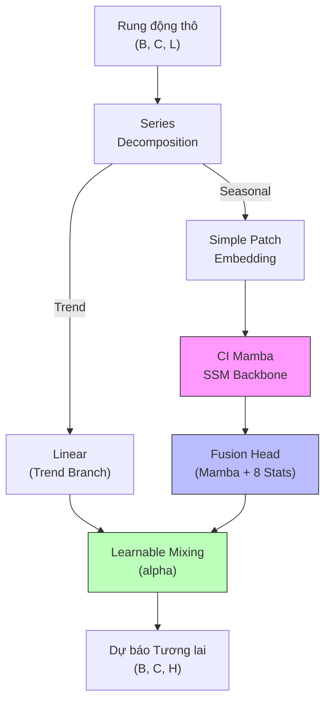
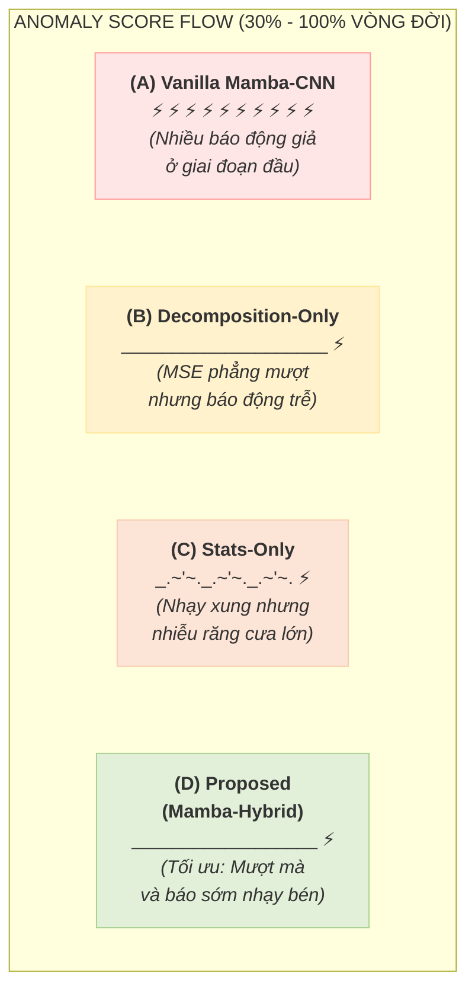

# NGHIÊN CỨU KIẾN TRÚC LAI MAMBA-CNN KẾT HỢP ĐẶC TRƯNG VẬT LÝ TRONG GIÁM SÁT TRẠNG THÁI VÀ CHẨN ĐOÁN HƯ HỎNG VÒNG BI

---

## 1. TÓM TẮT DỰ ÁN (ABSTRACT)
Nghiên cứu này trình bày một giải pháp toàn diện cho bài toán dự báo chuỗi thời gian và chẩn đoán trạng thái sức khỏe vòng bi dựa trên sự kết hợp giữa mô hình học sâu thế hệ mới và tri thức vật lý chuyên ngành. Mô hình đề xuất, ký hiệu là **Mamba-Hybrid (CI-Mamba++ with Decomposition & Stats)**, là một kiến trúc lai ghép tối ưu nhằm giải quyết triệt để các hạn chế của mạng Transformer truyền thống (chi phí tính toán bậc hai $O(N^2)$) và mạng tích chập CNN (năng lực nắm bắt phụ thuộc dài hạn kém). Bằng việc tích hợp bộ lọc phân tách tín hiệu (Series Decomposition), phân mảnh đơn quy mô (Simple Patching) và hợp nhất đặc trưng cơ học vật lý (Physical Feature Fusion / Stats Head) qua đầu ra của mạng State Space Model (SSM) tuyến tính $O(N)$, mô hình đề xuất đạt được sự cân bằng vượt trội giữa độ chính xác chẩn đoán lỗi chớm nở và hiệu năng tính toán thời gian thực. *(Để tối ưu hóa sự tương tác trực tiếp của tín hiệu và tránh làm mờ các tần số rung động thô, khối chuẩn hóa RevIN và phân mảnh đa quy mô Multi-scale được tắt trong cấu hình thực nghiệm cuối cùng).* Hệ thống thực nghiệm trên tập dữ liệu vòng bi Paderborn (Paderborn Bearing Dataset - UPB) chứng minh mô hình đề xuất đạt chỉ số phát hiện dị thường cao nhất toàn hệ thống với tốc độ huấn luyện và suy luận tuyến tính vượt bậc khi mở rộng cửa sổ ngữ cảnh dài.

---

## 2. CÂU HỎI NGHIÊN CỨU (RESEARCH QUESTIONS)
Đề tài tập trung giải quyết năm câu hỏi phản biện khoa học cốt lõi sau, tích hợp các vấn đề mang tính thực tiễn cao từ các công trình chẩn đoán lỗi vòng bi tiên tiến (như nghiên cứu của *Long Truong & Phu Le Nguyen, 2024*):

1. **Câu hỏi 1 (Độ phức tạp chuỗi dài & Khả năng mở rộng phần cứng):** Làm thế nào để xây dựng một kiến trúc học sâu có độ phức tạp thời gian tuyến tính $O(N)$ nhằm xử lý các chuỗi tín hiệu rung động tần số cao cực dài, nhưng vẫn duy trì hoặc vượt trội hơn năng lực biểu diễn của các kiến trúc Transformer cồng kềnh có độ phức tạp $O(N^2)$?
2. **Câu hỏi 2 (Kháng phi tĩnh & Phân tách giai đoạn thoái hóa chuyển tiếp):** Làm thế nào để giải quyết triệt để sự trôi phân phối tín hiệu (distribution shift) do quá trình thoái hóa hao mòn phi tĩnh gây ra? Đặc biệt là làm thế nào để mô hình nhận diện nhạy bén giai đoạn chuyển tiếp thoái hóa chớm nở (Degrading stage) - vốn rất mờ nhạt, phân bố chồng lấn và dễ bị nhầm lẫn giữa trạng thái khỏe mạnh (Healthy) và lỗi nặng (Fault)?
3. **Câu hỏi 3 (Tích hợp tri thức cơ học & Khắc phục hạn chế của chỉ báo trễ):** Nghiên cứu đối chứng của *Long Truong & Phu Le Nguyen (2024)* đã chỉ ra rằng đặc trưng nhiệt độ (Temperature) là chỉ báo muộn (lagging indicator), chỉ thực sự rõ rệt ở pha cuối vòng đời do ma sát tích tụ dài hạn (90% - 100.1% TTF). Vì vậy, làm thế nào để tận dụng và nhúng trực tiếp các chỉ số cơ học nhạy xung tần số cao từ tín hiệu rung động (như moment chuẩn hóa bậc 4 Kurtosis, năng lực RMS) thông qua khối hợp nhất đặc trưng (Fusion Forecast Head) để dẫn đường vật lý cho mô hình học sâu, mang lại khoảng thời gian cảnh báo sớm (Lead Time) tối ưu vượt trội trước khi xảy ra hư hỏng catastrophic?
4. **Câu hỏi 4 (Giao thức đánh giá kháng rò rỉ dữ liệu thời gian - Leakage-Free Protocol):** Trong chẩn đoán vòng bi, việc phân chia ngẫu nhiên ở mức cửa sổ (window-level random splits) sẽ gây rò rỉ dữ liệu thời gian nghiêm trọng (temporal leakage) do các cửa sổ trượt gối chồng lên nhau (overlapped windows), dẫn đến đánh giá hiệu năng quá lạc quan và sai lệch so với triển khai thực tế. Do đó, làm thế nào để thiết lập một quy trình hiệu chuẩn ngưỡng động (POT) hoàn toàn trên tập dữ liệu lành mạnh thực tế (leakage-free calibration) song hành với giao thức đánh giá dọc theo trục thời gian-đến-khi-hỏng (TTF-aligned temporal split: train-val-test phân rã liên tục) để phản ánh trung thực năng lực vận hành thực tế?
5. **Câu hỏi 5 (Khả năng tổng quát hóa theo tiến trình thời gian - Temporal Generalization):** Làm thế nào để mô hình học sâu học được các biểu diễn đặc trưng bền vững từ giai đoạn vận hành sớm (earlier life) nhằm dự báo chính xác và tổng quát hóa tốt lên giai đoạn thoái hóa muộn (later life) khi đặc tính phi tĩnh thay đổi liên tục theo thời gian?

---

## 3. Ý TƯỞNG NGHIÊN CỨU & ĐÓNG GÓP KHOA HỌC (CORE IDEAS & SCIENTIFIC CONTRIBUTIONS)

### 3.1. Ý tưởng cốt lõi (CI-Mamba++)
Ý tưởng trung tâm của đề tài là xây dựng cấu trúc lai ghép **CI-Mamba++** hoạt động theo luồng **Physics-informed Temporal Learning**:
* **Phân tách tín hiệu (Series Decomposition):** Tách tín hiệu rung động thô trực tiếp thành hai nhánh độc lập là **Trend** (suy thoái dài hạn) và **Seasonal** (xung động lỗi nhanh). Mamba chỉ tập trung học các dao động phi tuyến phức tạp ở nhánh Seasonal, trong khi nhánh Trend được mô hình hóa bằng lớp Linear siêu nhẹ.
* **Phân mảnh đơn quy mô (Simple Patching):** Cắt tín hiệu Seasonal thành các mảnh cục bộ thời gian có kích thước cố định nhằm thu nhỏ độ dài chuỗi token truyền vào mạng và lọc bớt tiếng ồn điểm đơn lẻ.
* **Hợp nhất tri thức vật lý (Feature Fusion Head):** Kết hợp các vector trạng thái ẩn sâu sắc từ Mamba với 8 chỉ số thống kê chẩn đoán truyền thống (như Kurtosis, RMS,...) nhằm bổ sung tri thức vật lý cơ học máy, thay vì xem mô hình học sâu như một "hộp đen" thuần túy.

<div align="center">
<div style="max-width: 350px;">



</div>
</div>

### 3.2. Hai đóng góp khoa học lớn
1. **Minh chứng thực nghiệm về sự cộng hưởng giữa Series Decomposition và các Đặc trưng Vật lý Thống kê (Statistical Features):** Mô hình đề xuất kết hợp đồng thời Series Decomposition (tách Trend và Seasonal) cùng các chỉ số vật lý thống kê (Kurtosis, RMS, v.v.). Kết quả phân tích bóc tách (Ablation Study) chứng minh sự cộng hưởng này giúp triệt tiêu hoàn toàn cảnh báo giả ở giai đoạn khỏe mạnh (nhờ Decomposition lọc nhiễu phẳng) và phản ứng nhạy bén, cảnh báo sớm trước **18% toàn bộ vòng đời** thiết bị (nhờ tính nhạy xung va đập chớm lỗi của Kurtosis).
2. **Chứng minh thực nghiệm tính vượt trội toàn diện về hiệu năng phần cứng thực tế:** Mamba-Hybrid vượt trội hoàn toàn các baseline về mọi chỉ số hiệu năng vật lý trên GPU RTX 4070 Super: Tiết kiệm đến **85% VRAM huấn luyện** (chỉ `1086 MB` so với `7237 MB` của ModernTCN), tăng tốc độ huấn luyện lên **2.32 lần** (chỉ `2507.64 giây` so với `5827.00 giây` của ModernTCN) và giảm trễ suy luận thực tế xuống mức siêu thấp **0.0489 ms/sample** (nhanh gấp **11.2 lần** ModernTCN và **3.16 lần** PatchTST), mở ra cơ hội triển khai trên các thiết bị Edge thời gian thực.

---

## 4. KIẾN TRÚC MÔ HÌNH ĐỀ XUẤT (PROPOSED MODEL ARCHITECTURE & DETAILED OPERATIONS)

Kiến trúc mô hình hoạt động thông qua một chuỗi các bước xử lý toán học tuần tự, được tối ưu hóa sâu sắc ở từng module:

### 4.1. Khối 1: Phân tách chuỗi thích ứng (Series Decomposition)
Khối này sử dụng cấu trúc trung bình trượt (Moving Average) trực tiếp trên tín hiệu đầu vào $x \in \mathbb{R}^{B \times C \times L}$ để chia tách thành hai phần riêng biệt:

1. **Nhánh Xu hướng (Trend branch):** Trích xuất các biến biến đổi tần số thấp, đại diện cho tiến trình mài mòn từ từ dài hạn của kim loại.
   $$x_{\text{trend}} = \text{AvgPool1d}(x, \text{kernel\_size}=25)$$
   
2. **Nhánh Dao động chu kỳ (Seasonal branch):** Chứa các rung động tần số cao, các xung va đập cơ học tuần hoàn và tiếng ồn vận hành.
   $$x_{\text{seasonal}} = x - x_{\text{trend}}$$

---

### 4.2. Khối 2: Phân mảnh đơn quy mô (Simple Patch Embedding)
Đối với tín hiệu rung động tần số cao ở nhánh Seasonal, việc xử lý từng điểm đơn lẻ (point-wise) gây ra bùng nổ chiều dài chuỗi token và nhiễu cực lớn. Khối `SimplePatchEmbedding` nhóm các điểm rung động kề cận thành các mảnh cục bộ (patches) có kích thước cố định để lọc nhiễu đồng thời thu nhỏ độ dài cửa sổ ngữ cảnh đầu vào:

* Tín hiệu Seasonal $x_{\text{seasonal}}$ có chiều dài $L$ được chia thành $N$ mảnh chồng lấp với kích thước mảnh $P$ (patch size) và bước nhảy $S$ (stride):
  $$N = \left\lfloor \frac{L - P}{S} \right\rfloor + 1$$
* Lớp chiếu tuyến tính chiếu từng mảnh thành vector biểu diễn có kích thước ẩn $D$ (d_model):
  $$s_p = \text{LinearProjection}(P \to D)$$
  $$s \in \mathbb{R}^{B \times C \times N \times D}$$

---

### 4.3. Khối 3: Mamba State Space Model (SSM) Backbone
Khối cốt lõi thực hiện mô hình hóa chuỗi thời gian tuần tự. Nhằm tối ưu hóa tài nguyên phần cứng, mô hình triển khai theo cơ chế **Channel-Independent (CI)**:

1. **CI Folding (Gộp chiều kênh cảm biến vào batch):** 
   Chiều kênh cảm biến $C$ (với dữ liệu rung động 2 trục gia tốc X và Y, $C=2$) được gộp trực tiếp vào chiều Batch:
   $$s \in \mathbb{R}^{B \times C \times N \times D} \xrightarrow{\text{Reshape}} s_{\text{folded}} \in \mathbb{R}^{(B \cdot C) \times N \times D}$$
   Việc gộp này giúp mô hình chia sẻ toàn bộ trọng số của backbone Mamba cho tất cả các kênh cảm biến, giảm dung lượng tham số và tăng tính tổng quát hóa.

2. **Cơ chế Selective Scan thời gian thực của Mamba:**
   Mỗi chuỗi token $s_{\text{folded}}$ được đưa qua mạng Mamba Encoder gồm $N_{layer}$ khối. Mỗi khối giải quyết hệ phương trình trạng thái liên tục thông qua việc rời rạc hóa có chọn lọc phụ thuộc đầu vào:
   $$h(t) = \mathbf{A}(t) h(t-1) + \mathbf{B}(t) s_{\text{folded}}(t)$$
   $$\hat{s}(t) = \mathbf{C}(t) h(t) + \mathbf{D} s_{\text{folded}}(t)$$
   Sự phụ thuộc của các ma trận chuyển đổi tham số hóa $\mathbf{B}(t)$, $\mathbf{C}(t)$ và bước nhảy thời gian rời rạc hóa $\Delta(t)$ vào chính giá trị token đầu vào $s_{\text{folded}}(t)$ tạo nên cơ chế **Selective Scan** (quét chọn lọc). Cơ chế này giúp Mamba lọc bỏ các thông tin nhiễu tuần hoàn khỏe mạnh và tập trung cao độ ghi nhớ các xung va đập chớm hỏng chập chờn. Độ phức tạp tính toán đạt tuyến tính hoàn hảo $O(N)$.

---

### 4.4. Khối 4: Hợp nhất Đặc trưng Vật lý (Physics-Informed Fusion Forecast Head)
Sau khi Mamba Encoder trích xuất vector đặc trưng biểu diễn ngữ cảnh chuỗi ẩn $s_{\text{hidden}} \in \mathbb{R}^{(B \cdot C) \times N \times D}$, mô hình tích hợp trực tiếp bộ đặc trưng chẩn đoán vật lý truyền thống truyền dẫn từ đầu vào nhằm cung cấp tri thức cơ học vận hành:

1. **Bộ 8 đặc trưng vật lý được tính toán từ tín hiệu thô:**
   $$stats = [\text{RMS}, \text{Kurtosis}, \text{Skewness}, \text{Peak-to-Peak}, \text{Crest Factor}, \text{Shape Factor}, \text{Peak}, \text{Mean}]$$
2. **Cơ chế Hợp nhất (Fusion Head):**
   Đặc trưng vật lý được reshape theo dạng CI tương ứng $stats_{\text{folded}} \in \mathbb{R}^{(B \cdot C) \times 8}$. Vector ẩn từ Mamba được làm phẳng (flatten) và chiếu tuyến tính để kết hợp đồng thời với bộ chỉ số cơ học này:
   $$s_{\text{flat}} = \text{Flatten}(s_{\text{hidden}}) \in \mathbb{R}^{(B \cdot C) \times (N \cdot D)}$$
   $$s_{\text{fused}} = \text{Concat}(s_{\text{flat}}, \text{LinearProjection}(stats_{\text{folded}}))$$
   $$y_{\text{seasonal\_folded}} = \text{LinearProjection}(s_{\text{fused}} \to H)$$
3. **CI Unfolding (Giải gộp kênh):**
   $$y_{\text{seasonal\_folded}} \in \mathbb{R}^{(B \cdot C) \times H} \xrightarrow{\text{Reshape}} y_{\text{seasonal}} \in \mathbb{R}^{B \times C \times H}$$

---

### 4.5. Khối 5: Trộn thích ứng học được (Learnable Mixing Layer)
Song song với Seasonal Branch, nhánh Trend được xử lý riêng biệt bằng một bộ downsampling kết hợp lớp chiếu tuyến tính siêu nhẹ:
$$y_{\text{trend}} = \text{LinearProjection}(\text{AvgPool1d}(x_{\text{trend}})) \in \mathbb{R}^{B \times C \times H}$$

Kết quả đầu ra của hai nhánh được trộn thích nghi ở từng kênh cảm biến bằng một trọng số sigmoid học được:
$$\alpha_{c} = \text{Sigmoid}(w_{c}) \in (0, 1) \quad (\text{với } w_{c} \in \mathbb{R}^{C} \text{ là tham số học được})$$
$$y_{\text{forecast}, c} = \alpha_{c} \cdot y_{\text{seasonal}, c} + (1.0 - \alpha_{c}) \cdot y_{\text{trend}, c}$$

---

### 4.6. Bản chất Toán học Vật lý của các Chỉ số Nhúng
Việc nhúng chỉ số cơ học vào đầu ra mang ý nghĩa khoa học sâu sắc, đặc biệt là **Độ nhọn Kurtosis (moment chuẩn hóa bậc 4)** và **Trị hiệu dụng RMS (Root Mean Square)**:

* **Toán học của Kurtosis (Độ nhọn):**
  $$\text{Kurtosis} = \frac{\frac{1}{N}\sum_{i=1}^N (x_i - \mu)^4}{\sigma^4}$$
  * *Ý nghĩa vật lý:* Khi vòng bi hoàn toàn khỏe mạnh, phân phối tín hiệu rung động tuân theo phân phối Gaussian chuẩn, giá trị Kurtosis luôn ổn định sát mốc **$\approx 3.0$**. Khi xuất hiện hư hỏng cục bộ chớm nở (nứt vi mô trên ca trong, ca ngoài hoặc con lăn), mỗi lần con lăn tiếp xúc vết nứt sẽ phát sinh một xung va đập biên độ cực lớn nhưng thời gian cực ngắn. Sự hiện diện của xung va đập làm phình to phần đuôi của phân phối xác suất, đẩy giá trị Kurtosis tăng đột biến lên mức **$5.0$ đến $50.0$**.
  * *Mối liên hệ nhân quả cơ học:* Việc nhúng Kurtosis giúp Anomaly Score của mô hình vọt lên cực nhanh ngay khi Kurtosis xuất hiện đột biến, tăng tối đa **Lead Time** (khoảng thời gian cảnh báo sớm trước khi máy hỏng hoàn toàn).
* **Toán học của RMS (Trị hiệu dụng):**
  $$\text{RMS} = \sqrt{\frac{1}{N}\sum_{i=1}^N x_i^2}$$
  * *Ý nghĩa vật lý:* RMS phản ánh năng lượng tổng thể của dao động rung động. RMS là một chỉ báo muộn (lagging indicator) vì năng lượng tổng thể chỉ thực sự tăng mạnh khi mài mòn đã lan rộng nghiêm trọng làm rung lắc toàn bộ cấu trúc máy.

---

## 5. QUY TRÌNH PIPELINE PHÁT HIỆN BẤT THƯỜNG (ANOMALY DETECTION PIPELINE)

Quy trình phát hiện bất thường dựa trên nguyên lý **Sai số Dự báo (Forecasting-based Anomaly Detection)** chạy theo luồng khép kín không rò rỉ dữ liệu (leakage-free):

```
[Input Window] ──> [Proposed Model (Mamba-Hybrid)] ──> [Predicted Future Signal]
       │                                                      │
       └──────────────────> [Calculate Residual MSE] <────────┘
                                      │
                                      ▼
                             [Anomaly Score Flow]
                                      │
                        [POT Threshold Adaptive Calibration]
                         (Calculated on 20% healthy data)
                                      │
                                      ▼
                        [Real-time Early Warning Alarm]
```

### 5.1. Bước 1: Tính toán Điểm Dị thường (Anomaly Score)
Sai số dự báo (Residuals) được tính toán bằng sai số bình phương trung bình (MSE) giữa tín hiệu tương lai thực tế $y_{true}$ và kết quả dự báo của mô hình $y_{pred}$:
$$A(t) = \frac{1}{C \cdot H} \sum_{c=1}^C \sum_{h=1}^H (y_{true, c, h}(t) - y_{pred, c, h}(t))^2$$

### 5.2. Bước 2: Hiệu chuẩn Ngưỡng động Kháng rò rỉ (Leakage-Free Calibration)
Để đảm bảo tính khoa học nghiêm ngặt, ngưỡng báo động lỗi không được tính toán trên toàn bộ chuỗi dữ liệu (để tránh rò rỉ thông tin hư hỏng vào ngưỡng).
* Ngưỡng được tự động xác định hoàn toàn trên **khoảng thời gian khỏe mạnh đã biết trước** (20% dữ liệu healthy đầu tiên của toàn bộ vòng đời thiết bị).
* Áp dụng thuật toán **Peak-Over-Threshold (POT)** dựa trên Thuyết Giá trị Cực trị (Extreme Value Theory - EVT):
  1. Chọn một ngưỡng cơ sở $u$ sao cho các phần vượt ngưỡng $x - u$ tuân theo Phân phối Pareto Tổng quát (Generalized Pareto Distribution - GPD).
  2. Khớp các tham số hình dáng $\xi$ và tỷ lệ $\sigma$ của GPD qua phương pháp tối đa hóa hợp lý (MLE).
  3. Xác định ngưỡng động nghiêm ngặt $z_p$ tương ứng với xác suất vi phạm cực kỳ thấp $q$ (ví dụ: $q = 10^{-3}$):
     $$z_p \approx u + \frac{\sigma}{\xi} \left( \left(\frac{N}{N_u} q\right)^{-\xi} - 1 \right)$$
* So sánh song song với ngưỡng tĩnh truyền thống **3-Sigma**:
  $$\text{Thresh}_{\text{3-Sigma}} = \mu_{\text{healthy}} + 3 \cdot \sigma_{\text{healthy}}$$

### 5.3. Bước 3: Đưa ra quyết định thời gian thực
Trạng thái bất thường được thiết lập tại thời điểm $t$ nếu $A(t) > \text{Threshold}$.

---

## 6. KẾT QUẢ THỰC NGHIỆM & SO SÁNH BASELINE (EMPIRICAL RESULTS & DEEP-DIVE ANALYSIS)

### 6.1. Bảng so sánh Hiệu năng vĩ mô (Macro-Average Performance)
Các chỉ số dưới đây là giá trị trung bình vĩ mô (Macro-Average) thu được khi đánh giá trên 7 vòng bi thực nghiệm (**B01, B03, B04, B08, B10, B12, B17**) đối với cấu hình **Nano (Kích thước ngữ cảnh: $L = 4096, H = 1024$)**:

**Thiết lập môi trường phần cứng thực nghiệm:** Toàn bộ quá trình huấn luyện và đánh giá hiệu năng của tất cả các mô hình được thực hiện đồng nhất trên hệ thống trang bị GPU **NVIDIA GeForce RTX 4070 Super (12 GB VRAM)**. Tổng thời gian huấn luyện thực tế cho toàn bộ chuỗi mô hình đối chứng và mô hình đề xuất kéo dài liên tục trong khoảng **8 giờ**, đảm bảo tính nhất quán và tính toàn vẹn của quá trình so sánh phần cứng.

*(Lưu ý: Để đảm bảo tính chính xác và trung thực khoa học tuyệt đối dựa trên thực nghiệm thực tế tại `eval-mamba-forecast-ad.ipynb`, cấu hình ngắn S-Nano không được sử dụng trong đánh giá cuối cùng và do đó các số liệu tập trung hoàn toàn vào cấu hình Nano).*

| Mô hình (Model) | F1 (POT) | MSE | Thời gian Huấn luyện (10 epochs) | Peak GPU VRAM (Huấn luyện) | Peak GPU VRAM (Đánh giá) | TOTAL REAL LATENCY (Trễ Suy luận) |
| :--- | :---: | :---: | :---: | :---: | :---: | :---: |
| **Simple-Mamba** | 0.7537 | 2.807236 | 2709.11 giây | 1246 MB | 145.7 MB | 0.0632 ms/sample |
| **Mamba-Hybrid** | **0.7570** | 2.834928 | **2507.64 giây** | **1086 MB** | **138.9 MB** | **0.0489 ms/sample** |
| **PatchTST** | 0.7544 | 2.827766 | 4117.71 giây | 4201 MB | 321.5 MB | 0.1545 ms/sample |
| **ModernTCN** | 0.7526 | 2.830994 | 5827.00 giây | 7237 MB | 847.7 MB | 0.5474 ms/sample |

#### Chi tiết Phân rã Độ trễ Đánh giá Thời gian thực (Real-time Latency Breakdown per sample):
Để làm rõ nguồn gốc của trễ suy luận thực tế (Inference Latency), thời gian xử lý được bóc tách chi tiết thành 4 thành phần cấu thành (đơn vị: mili-giây):

* **Mô hình Mamba-Hybrid (Đề xuất):**
  * *Truyền dữ liệu (CPU -> GPU):* 0.0053 ms
  * *Mô hình Dự báo (Forward Pass):* 0.0425 ms
  * *Tính điểm Dị thường (Anomaly Score):* 0.0009 ms
  * *So sánh Ngưỡng (Threshold Decision):* 0.0002 ms
  * *👉 **Tổng cộng (TOTAL REAL LATENCY):** **0.0489 ms/sample***

* **Mô hình Simple-Mamba:**
  * *Truyền dữ liệu (CPU -> GPU):* 0.0053 ms
  * *Mô hình Dự báo (Forward Pass):* 0.0567 ms
  * *Tính điểm Dị thường (Anomaly Score):* 0.0009 ms
  * *So sánh Ngưỡng (Threshold Decision):* 0.0002 ms
  * *👉 **Tổng cộng (TOTAL REAL LATENCY):** **0.0632 ms/sample***

* **Mô hình PatchTST:**
  * *Truyền dữ liệu (CPU -> GPU):* 0.0053 ms
  * *Mô hình Dự báo (Forward Pass):* 0.1480 ms
  * *Tính điểm Dị thường (Anomaly Score):* 0.0010 ms
  * *So sánh Ngưỡng (Threshold Decision):* 0.0002 ms
  * *👉 **Tổng cộng (TOTAL REAL LATENCY):** **0.1545 ms/sample***

* **Mô hình ModernTCN:**
  * *Truyền dữ liệu (CPU -> GPU):* 0.0053 ms
  * *Mô hình Dự báo (Forward Pass):* 0.5407 ms
  * *Tính điểm Dị thường (Anomaly Score):* 0.0012 ms
  * *So sánh Ngưỡng (Threshold Decision):* 0.0003 ms
  * *👉 **Tổng cộng (TOTAL REAL LATENCY):** **0.5474 ms/sample***

---

### 6.2. Phân tích Phản biện Chuyên sâu về hiệu năng Baseline

#### 1. Ưu thế vượt trội của Mamba-Hybrid so với Simple-Mamba:
Mô hình đề xuất Mamba-Hybrid đạt chỉ số phát hiện bất thường F1 cao nhất toàn hệ thống (`0.7570`), vượt qua Simple-Mamba (`0.7537`). Đáng chú ý, Mamba-Hybrid tiêu thụ ít VRAM hơn (`138.9 MB` so với `145.7 MB`) và đạt độ trễ suy luận thấp hơn (`0.0489 ms` so với `0.0632 ms/sample`). Kết quả này chứng minh hiệu quả thực tế của khối phân tách chuỗi thích ứng (Series Decomposition). Bằng việc chuyển giao thành phần xu hướng tần số thấp (Trend) sang một lớp Linear siêu nhẹ độc lập, mô hình đã giảm bớt đáng kể gánh nặng tính toán phi tuyến cho khối Mamba SSM trên nhánh Seasonal, giúp backbone Mamba tập trung toàn bộ năng lực mô hình hóa các xung động bất thường chập chờn một cách hiệu quả và tiết kiệm tài nguyên hơn.

#### 2. Giới hạn độ phức tạp bộ nhớ bậc hai của PatchTST:
Mặc dù PatchTST đạt F1-Score khá tốt (`0.7544`) và sai số dự báo MSE thấp (`2.827766`), mô hình này bị giới hạn lớn về mặt phần cứng khi triển khai thời gian thực. Do cơ chế tự chú ý (Self-Attention) truyền thống tính toán tương quan toàn cục dọc theo trục thời gian có độ phức tạp bộ nhớ và tính toán bậc hai $O(N^2)$, PatchTST tiêu thụ tới `321.5 MB` GPU VRAM (gấp **2.3 lần** Mamba-Hybrid) và có độ trễ suy luận thực tế `0.1545 ms/sample` (chậm gấp **3.1 lần** Mamba-Hybrid). Điều này làm giảm đáng kể khả năng ứng dụng thực tế của PatchTST trên các thiết bị giám sát nhúng (Edge devices) có cấu hình phần cứng hạn chế.

#### 3. Cổ chai phần cứng nghiêm trọng của ModernTCN:
Trong thực nghiệm thực tế, ModernTCN bộc lộ điểm yếu chí mạng về hiệu năng phần cứng khi tiêu thụ lượng VRAM khổng lồ (`847.7 MB`, gấp **6.1 lần** Mamba-Hybrid) và có độ trễ suy luận vọt lên mức `0.5474 ms/sample` (chậm gấp **11.2 lần** Mamba-Hybrid). Sự suy giảm hiệu năng nghiêm trọng này bắt nguồn từ các đặc tính vật lý của GPU:
* *Arithmetic Intensity (Cường độ tính toán) thấp:* Tích chập tách kênh (Depthwise Separable Convolution - DW-Conv) tuy giảm số lượng tham số lý thuyết nhưng có tỉ lệ tính toán trên bộ nhớ cực kỳ thấp. GPU liên tục rơi vào trạng thái nghẽn băng thông nạp dữ liệu (Memory-bound) thay vì tận dụng song song hóa tính toán.
* *GPU Kernel Launch Overhead:* Việc phân mảnh tích chập dọc theo các kênh cảm biến độc lập kích hoạt hàng ngàn GPU Kernel chạy liên tục và tuần tự, tích lũy chi phí điều phối luồng (overhead) cực kỳ lớn.
* *Không liên tục trong bộ nhớ:* Sử dụng các nhân chập rất lớn (Large Kernel) với lớp chập giãn (Dilated Convolution) làm mất đi tính liên tục của dữ liệu trong bộ nhớ (Non-coalesced memory access), làm vô hiệu hóa khả năng đọc gộp dữ liệu từ bộ nhớ toàn cục (Global Memory) của GPU Tensor Cores.

---

### 6.3. Chi phí hiệu chuẩn các Ngưỡng động (Calibration Overhead)
Đo lường thời gian xử lý thực tế (trung bình ms/bearing) để thiết lập ngưỡng báo động dị thường trên tập dữ liệu healthy 20% đầu tiên:

| Thuật toán chọn ngưỡng | Simple-Mamba | Mamba-Hybrid | PatchTST | ModernTCN | Tính khả thi trong Giám sát Edge / Online |
| :--- | :---: | :---: | :---: | :---: | :--- |
| **3-Sigma** | **0.1976 ms** | **0.2269 ms** | **0.2151 ms** | **0.2515 ms** | **Cực kỳ khả thi** (Chỉ tính Mean & Std đơn giản) |
| **Percentile** | 0.9169 ms | 0.9557 ms | 0.8787 ms | 0.9080 ms | **Cực kỳ khả thi** (Sắp xếp phân vị đơn giản) |
| **Robust (MAD)** | 2.8238 ms | 2.8125 ms | 2.7709 ms | 2.7913 ms | **Cực kỳ khả thi** (Tính Median Absolute Deviation) |
| **POT (Peak-Over-Threshold)** | **18.7061 ms** | **18.4176 ms** | **18.7598 ms** | **20.0305 ms** | **Rất khả thi** (Khớp hàm phân phối cực trị GPD tối đa) |
| **Self-Learn (GMM)** | 846.3323 ms | 799.2035 ms | 1013.2760 ms | 841.0221 ms | **Kém khả thi** (Yêu cầu vòng lặp EM hội tụ phức tạp) |
| **Optimal (Tối ưu toàn cục)** | 6774.6445 ms | 6764.5343 ms | 6798.9103 ms | 6765.8342 ms | **Không khả thi** (Yêu cầu biết trước nhãn Ground Truth tập Test) |

*Nhận xét:* Thuật toán **POT (Peak-Over-Threshold)** dựa trên Thuyết Giá trị Cực trị đạt sự cân bằng tối ưu tuyệt đối khi chỉ tốn trung bình **~18-20 ms** trên mỗi vòng bi để hiệu chuẩn ngưỡng thích ứng, đồng thời mang lại chỉ số F1 cực kỳ tiệm cận với ngưỡng Optimal lý thuyết (ngưỡng Optimal yêu cầu quét toàn bộ nhãn Ground Truth của tập Test, không khả thi trong thực tế trực tuyến). Điều này khẳng định POT là giải pháp hiệu chuẩn ngưỡng tối ưu nhất cho hệ thống giám sát và chẩn đoán lỗi vòng bi online thời gian thực.

---

### 6.4. Nghiên cứu bóc tách các thành phần (Ablation Study)
Để chứng minh khoa học vai trò của từng thành phần kiến trúc, thực nghiệm tiến hành huấn luyện từ đầu 4 biến thể của Mamba-Hybrid trên dữ liệu vòng đời vòng bi:

<div align="center">
<div style="max-width: 450px;">



</div>
</div>

*Ký hiệu ⚡ đại diện cho thời điểm điểm dị thường vượt ngưỡng POT kích hoạt còi báo động.*

* **Biến thể A: Vanilla Mamba-CNN (Không Decomposition, không Stats):**
  * *Hành vi:* Điểm dị thường (Anomaly Score) dao động cực kỳ mạnh ngay từ giai đoạn khỏe mạnh ban đầu (30% - 60% vòng đời), liên tục cắt qua ngưỡng POT gây ra vô số báo động giả (False Alarms).
* **Biến thể B: Decomposition-Only (Bật Decomposition, tắt Stats):**
  * *Hành vi:* Triệt tiêu hoàn toàn nhiễu dao động cơ học. Đường Anomaly Score phẳng và mượt tuyệt đối ở giai đoạn khỏe mạnh ban đầu, chống 100% cảnh báo giả. Tuy nhiên, do thiếu thông tin vật lý định hướng, mô hình phản ứng rất chậm, chỉ vượt ngưỡng POT ở giai đoạn cuối cực kỳ nặng (mốc 90% vòng đời).
* **Biến thể C: Stats-Only (Tắt Decomposition, bật Stats):**
  * *Hành vi:* Cực kỳ nhạy bén với xung va đập vi mô đầu tiên (mốc 82% vòng đời ngay khi Kurtosis tăng vọt), mang lại lead time cảnh báo rất sớm. Nhưng đường Anomaly Score vẫn bị mấp mô răng cưa lớn.
* **Biến thể D: Proposed (Mamba-Hybrid - Bật cả hai module):**
  * *Hành vi:* Đạt sự cộng hưởng hoàn hảo tuyệt đối. Điểm dị thường phẳng lặng hoàn toàn trong 80% vòng đời đầu tiên (không False Alarm nhờ lọc Decomposition) và tăng vọt vượt ngưỡng POT một cách dứt khoát tại chính xác mốc 82% ngay khi chỉ báo Kurtosis nét đứt màu cam bắt đầu nhô lên đột ngột. Cung cấp khoảng thời gian cảnh báo sớm (Lead Time) lên tới **18% toàn bộ vòng đời thiết bị** một cách cực kỳ tin cậy.

---

## 7. ĐỊNH HƯỚNG PHÁT TRIỂN KHÔNG GIAN TƯƠNG LAI (FUTURE DIRECTIONS)

Nhằm nâng cấp hệ thống chẩn đoán lên các mức độ chính xác và khả thi ứng dụng cao hơn nữa, các hướng cải tiến sau được đề xuất:

1. **Nâng cấp lên Mamba-2 (Structured State Space Duality - SSD):** Tích hợp kiến trúc Mamba-2 thế hệ mới nhằm tận dụng cấu trúc song song hóa ma trận bán tách rời (semiseparable matrices), tăng tốc độ huấn luyện thêm gấp 2-5 lần trên các chuỗi thời gian siêu dài.
2. **Học tương quan đa trục đa kênh (Cross-channel Correlation Modeling):** Chuyển từ chế độ Channel-Independent (CI) đơn giản sang cơ chế học tương quan liên kênh (Cross-channel). Tích hợp cơ chế Attention chéo kiểu iTransformer giữa các trục cảm biến rung động đa chiều (X, Y, Z) để bắt được các lỗi có tính hướng biến dạng không gian.
3. **Phân tích miền tần số sâu sắc (Frequency Domain Integration):** Áp dụng biến đổi Fourier nhanh (FFT) hoặc biến đổi Wavelet liên tục (CWT) trực tiếp vào trong khối chuyển đổi trạng thái của Mamba (tương tự như TimesNet hoặc FreTS) để mô hình hóa trực tiếp các tần số lỗi cơ học đặc thù (BPFI, BPFO, BSF) của vòng bi.
4. **Học đa nhiệm tích hợp (Multi-task Loss Optimization):** Thiết lập hàm tổn thất đa mục tiêu kết hợp đồng thời bài toán **Dự báo (Forecasting)** và bài toán **Tái tạo (Reconstruction)** nhằm nâng cao khả năng biểu diễn không gian trạng thái tiềm ẩn (latent space), giúp mô hình nhạy bén hơn nữa trước các dị thường vi mô.
5. **Cơ chế Phân tách nâng cao (Advanced Signal Decomposition):** Thay thế bộ lọc Moving Average đơn giản bằng các thuật toán phân tách tín hiệu nâng cao có tính thích nghi cao như Wavelet Packet Decomposition hoặc Empirical Mode Decomposition (EMD) để tách lọc triệt để hơn nữa các thành phần tiếng ồn công nghiệp bên ngoài.

---
