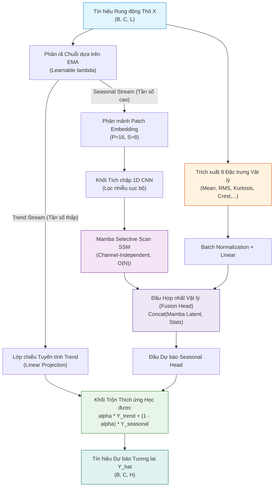
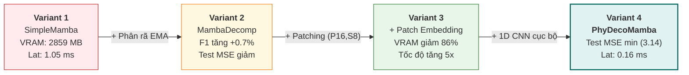

# BÁO CÁO TỔNG QUAN DỰ ÁN: NGHIÊN CỨU KIẾN TRÚC PhyDecoMamba KẾT HỢP TRI THỨC VẬT LÝ VÀ HIỆU CHUẨN NGƯỠNG EVT/POT TRONG CHẨN ĐOÁN HƯ HỎNG VÒNG BI

---

> **Thông tin công trình khoa học (Cập nhật mới nhất theo bản thảo Springer / FISAT):**
> * **Tên bài báo:** *PhyDecoMamba: Physics-Aware Decomposed Mamba for EVT-Calibrated Bearing Detection*
> * **Tác giả:** Long Truong¹, Binh Thuan Truong², Hung Lam Ly², Phu Le Nguyen³*
>   * ¹ Khoa Kỹ thuật Phần mềm, Trường Đại học FPT, TP. Hồ Chí Minh, Việt Nam
>   * ² Khoa Công nghệ Thông tin, Trường Đại học Tôn Đức Thắng, TP. Hồ Chí Minh, Việt Nam
>   * ³ Khoa Kỹ thuật và Công nghệ, Trường Đại học Nguyễn Tất Thành, TP. Hồ Chí Minh, Việt Nam (*Tác giả liên hệ: pnguyen@ntt.edu.vn*)
> * **Mã nguồn dự án:** [https://github.com/sunbv56/mamba-forecast-ad](https://github.com/sunbv56/mamba-forecast-ad)

---

## 1. TÓM TẮT DỰ ÁN (ABSTRACT & KEYWORDS)

### 1.1. Tóm tắt (Abstract)
Giám sát trạng thái và phát hiện bất thường không giám sát trên vòng bi dựa trên tín hiệu gia tốc rung động đóng vai trò sống còn trong việc đảm bảo an toàn vận hành của hệ thống cơ điện tử công nghiệp. Tuy nhiên, các phương pháp tiếp cận truyền thống hiện nay đang đối mặt với ba nút thắt nghiêm trọng: 
1. Tính chất phi tĩnh (non-stationary) và động học phi tuyến tính của tín hiệu rung động làm mờ nhạt các xung va đập hư hỏng ở giai đoạn chớm nở.
2. Các mô hình học sâu chuỗi thời gian thuần túy hoạt động như các "hộp đen" thiếu tính giải thích cơ học vật lý rõ ràng.
3. Việc lựa chọn ngưỡng bất thường bằng cách quét trên dữ liệu kiểm định toàn cục gây rò rỉ dữ liệu tương lai nghiêm trọng (data leakage), làm sai lệch đánh giá so với triển khai thực tế trực tuyến.

Để giải quyết triệt để các hạn chế trên, nghiên cứu này đề xuất khung kiến trúc dự báo nhận thức vật lý **PhyDecoMamba** (*Physics-Aware Decomposed Mamba*). Khung kiến trúc phân rã chuỗi thời gian thô thành hai nhánh động học độc lập: thành phần xu hướng suy thoái dài hạn (Trend) và thành phần dao động xung cơ học tần số cao (Seasonal). Nhánh Seasonal được xử lý qua khối phân mảnh đơn quy mô (Simple Patching), tích chập 1D lọc nhiễu cục bộ và cơ chế quét chọn lọc (Selective Scan) thời gian tuyến tính $\mathcal{O}(N)$ của mô hình không gian trạng thái Mamba độc lập kênh (Channel-Independent). 

Nhằm củng cố khả năng giải thích cơ học, không gian biểu diễn ẩn được nhúng trực tiếp với một đầu trích xuất đặc trưng thống kê vật lý 8 chiều (8D Physical-Statistical Head). Hệ thống tích hợp quy trình hiệu chuẩn ngưỡng động không rò rỉ dữ liệu dựa trên Thuyết Giá trị Cực trị (EVT) thông qua kỹ thuật Vượt Ngưỡng (Peak Over Threshold - POT) chỉ sử dụng các đoạn dữ liệu khỏe mạnh cục bộ ban đầu. Dưới quy chuẩn kiểm định nghiêm ngặt về sự tương đương ngân sách tham số (~338k tham số) trên bộ dữ liệu vòng bi Paderborn (UPB), **PhyDecoMamba** đạt chỉ số F1-Score **75.65%** dưới ngưỡng POT, Test MSE đạt mức thấp nhất toàn hệ thống (**4.2488**), chỉ tiêu tốn **215.9 MB** GPU VRAM ở Batch Size 64 và đạt độ trễ suy luận siêu thấp **1.01 ms/sample** ở cấu hình thông lượng cao (Batch Size 1024), mở ra khả năng triển khai xuất sắc trên các thiết bị giám sát nhúng tại biên.

### 1.2. Từ khóa (Keywords)
*Mô hình không gian trạng thái chọn lọc (Selective State Space Models)*, *PhyDecoMamba*, *Phân rã chuỗi thời gian (Series Decomposition)*, *Phát hiện bất thường vòng bi (Bearing Anomaly Detection)*, *Hiệu chuẩn không rò rỉ dữ liệu (Leakage-Free Calibration)*, *Kỹ thuật vượt ngưỡng (Peak Over Threshold - POT)*.

---

## 2. ĐẶT VẤN ĐỀ & CÁC CÂU HỎI NGHIÊN CỨU CỐT LÕI

### 2.1. Ba thách thức nghiên cứu cốt lõi
1. **Thách thức 1 (Độ phức tạp chuỗi dài và Hạn chế tài nguyên phần cứng):** Các cơ chế tự chú ý (Self-Attention) trong mạng Transformer (như PatchTST, TimesNet) có độ phức tạp tính toán và bộ nhớ bậc hai $\mathcal{O}(N^2)$. Khi xử lý các chuỗi rung động tần số cao cực dài, Transformer nhanh chóng gây tràn bộ nhớ (Out-Of-Memory - OOM) trên phần cứng nhúng biên (Edge AI), cản trở việc giám sát đa kênh liên tục.
2. **Thách thức 2 (Hộp đen thiếu giải thích cơ học & Phân tách suy thoái phi tĩnh):** Quá trình mài mòn cơ học khiến tín hiệu rung liên tục bị trôi phân phối. Các mô hình học sâu thuần túy thiếu sự ràng buộc với các định luật cơ học máy, dẫn đến biểu diễn không gian ẩn dễ bị đánh lừa bởi tiếng ồn băng rộng hoặc rung động nền của tải vận hành.
3. **Thách thức 3 (Rò rỉ dữ liệu khi hiệu chuẩn ngưỡng phát hiện - Data Leakage):** Nhiều nghiên cứu hiện hành sử dụng ngưỡng tĩnh hoặc tối ưu ngưỡng toàn cục (Global Threshold Tuning) trên toàn bộ tập dữ liệu (vốn chứa sẵn các mẫu lỗi ở tương lai). Trong điều kiện triển khai trực tuyến thực tế (Online Continuous Monitoring), hệ thống chỉ có thể tiếp cận dữ liệu lịch sử ở trạng thái khỏe mạnh ban đầu.

### 2.2. Năm câu hỏi phản biện khoa học (Research Questions)
* **RQ1:** Làm thế nào để xây dựng một kiến trúc học sâu có độ phức tạp thời gian tuyến tính $\mathcal{O}(N)$ nhằm xử lý chuỗi rung động ngữ cảnh dài nhưng vẫn duy trì độ chính xác nắm bắt tương quan dài hạn vượt trội?
* **RQ2:** Làm thế nào để phân tách triệt để động học suy thoái tần số thấp (Trend) khỏi các xung va đập chu kỳ tần số cao (Seasonal) nhằm giảm thiểu hiện tượng trôi phân phối tín hiệu?
* **RQ3:** Làm thế nào để kết hợp tri thức vật lý cơ học rõ ràng (độ nhọn Kurtosis, năng lượng RMS, hệ số dạng Shape Factor,...) vào không gian ẩn của mạng học sâu nhằm triệt tiêu báo động giả và phát hiện sớm hư hỏng chớm nở?
* **RQ4:** Làm thế nào để thiết lập một quy trình xác định ngưỡng động tự động thích ứng dựa trên Thuyết Giá trị Cực trị (EVT/POT) hoàn toàn trên phân đoạn khỏe mạnh ban đầu, đảm bảo tính kháng rò rỉ dữ liệu tuyệt đối?
* **RQ5:** Dưới quy chuẩn kiểm định công bằng về mặt ngân sách tham số phần cứng (Parameter Budget Parity), mô hình đề xuất thể hiện ưu thế như thế nào so với các baseline chuẩn mực (LSTM, Simple-Mamba, PatchTST) về độ chính xác, mức tiêu thụ VRAM và độ trễ suy luận?

---

## 3. Ý TƯỞNG CỐT LÕI & ĐÓNG GÓP KHOA HỌC

### 3.1. Ý tưởng cấu trúc cốt lõi của PhyDecoMamba
Ý tưởng trung tâm là thiết lập mô hình học sâu nhận thức vật lý kết hợp phân rã chuỗi thời gian (*Physics-Informed Series-Decomposed Mamba*):
* **Phân rã chuỗi thích ứng (Adaptive Series Decomposition):** Tín hiệu thô được phân tách bằng bộ lọc trung bình trượt lũy thừa (EMA) có hệ số $\lambda$ tự học qua lan truyền ngược, tách biệt động học thành nhánh Trend mượt mà và nhánh Seasonal dao động nhanh.
* **Xử lý nhánh Seasonal hiệu năng cao:** Phân mảnh tín hiệu (Patching) với kích thước $P=16$, bước nhảy $S=8$ giúp nén chuỗi token; kết hợp khối tích chập 1D CNN cục bộ nhằm triệt tiêu nhiễu nền tần số cao trước khi đưa vào backbone Mamba.
* **Mamba SSM Backbone độc lập kênh (Channel-Independent):** Tận dụng cơ chế Selective Scan thời gian tuyến tính $\mathcal{O}(N)$, chia sẻ trọng số giữa các trục cảm biến gia tốc nhằm hạn chế sự lan truyền nhiễu liên kênh.
* **Đầu trích xuất thống kê vật lý (8D Stats Head):** Nhúng trực tiếp 8 chỉ số cơ học thời gian được chuẩn hóa qua BatchNorm vào vector ngữ cảnh ẩn, tạo cầu nối toán học giữa biểu diễn sâu và các hiện tượng mài mòn kim loại.
* **Trộn thích ứng học được (Learnable Mixing):** Kết hợp đầu ra dự báo của nhánh Trend (chiếu Linear nhẹ) và nhánh Seasonal thông qua trọng số Sigmoid học được độc lập cho từng kênh $\alpha_c = \sigma(w_c)$.

```mermaid
graph TD
    Raw["Tín hiệu Rung động Thô X<br>(B, C, L)"] --> Decomp["Phân rã Chuỗi dựa trên EMA<br>(Learnable lambda)"]
    
    Decomp -->|"Trend Stream (Tần số thấp)"| TrendLinear["Lớp chiếu Tuyến tính Trend<br>(Linear Projection)"]
    Decomp -->|"Seasonal Stream (Tần số cao)"| Patch["Phân mảnh Patch Embedding<br>(P=16, S=8)"]
    
    Patch --> Conv["Khối Tích chập 1D CNN<br>(Lọc nhiễu cục bộ)"]
    Conv --> Mamba["Mamba Selective Scan SSM<br>(Channel-Independent, O(N))"]
    
    Raw --> Stats["Trích xuất 8 Đặc trưng Vật lý<br>(Mean, RMS, Kurtosis, Crest,...)"]
    Stats --> BN["Batch Normalization + Linear"]
    
    Mamba --> Fusion["Đầu Hợp nhất Vật lý (Fusion Head)<br>Concat(Mamba Latent, Stats)"]
    BN --> Fusion
    Fusion --> ForecastHead["Đầu Dự báo Seasonal Head"]
    
    TrendLinear --> Mix["Khối Trộn Thích ứng Học được<br>alpha * Y_trend + (1 - alpha) * Y_seasonal"]
    ForecastHead --> Mix
    
    Mix --> Pred["Tín hiệu Dự báo Tương lai Y_hat<br>(B, C, H)"]
    
    style Raw fill:#e1f5fe,stroke:#0288d1,stroke-width:1px
    style Mamba fill:#f3e5f5,stroke:#7b1fa2,stroke-width:1px
    style Stats fill:#fff3e0,stroke:#e65100,stroke-width:1px
    style Fusion fill:#ede7f6,stroke:#512da8,stroke-width:1px
    style Mix fill:#e8f5e9,stroke:#2e7d32,stroke-width:1px
    style Pred fill:#e0f2f1,stroke:#00695c,stroke-width:1px
```

### 3.2. Ba đóng góp khoa học chính của công trình
1. **Kiến trúc phân rã chuỗi kết hợp Selective State Space Model:** Đề xuất mô hình PhyDecoMamba kết hợp phân rã chuỗi thời gian, phân mảnh Patching và mạng Mamba chọn lọc, đạt độ phức tạp thời gian tuyến tính $\mathcal{O}(N)$ đồng thời ngăn chặn sự lan truyền nhiễu liên kênh nhờ cấu trúc Channel-Independent.
2. **Khả năng giải thích cấu trúc nhận thức vật lý (Physics-Informed Structural Interpretability):** Tích hợp trực tiếp đầu thống kê vật lý 8 chiều vào không gian ẩn, tạo cầu nối chặt chẽ giữa các biểu diễn sâu trừu tượng với các mô tả cơ học máy tường minh mà không cần các công cụ giải thích bên ngoài (như SHAP hay LIME).
3. **Quy trình hiệu chuẩn ngưỡng động không rò rỉ dữ liệu (Leakage-Free Validation Workflow):** Thiết lập quy trình xác định ngưỡng quyết định bất thường tự động dựa trên Thuyết Giá trị Cực trị (EVT) qua phương pháp Vượt Ngưỡng (POT), bảo đảm các ranh giới cảnh báo được tính toán thuần túy từ phân đoạn khỏe mạnh ban đầu, loại bỏ hoàn toàn hiện tượng rò rỉ dữ liệu thời gian.

---

## 4. MA TRẬN ĐỐI CHIẾU TÀI LIỆU TOÀN DIỆN (LITERATURE COMPARISON)

Để làm rõ vị thế khoa học của PhyDecoMamba, Bảng 1 tóm tắt sự đối chiếu cấu trúc và đặc tính kỹ thuật giữa phương pháp đề xuất với các họ mô hình chẩn đoán đại diện trong tài liệu học thuật (tương ứng với Table 1 trong bài báo gốc):

**Bảng 1. Ma trận đối chiếu tài liệu và phân tích cấu trúc mô hình.**

| Phương pháp / Nghiên cứu | Họ phương pháp | Điểm mạnh chính | Hạn chế cốt lõi | Mối liên hệ với PhyDecoMamba |
| :--- | :--- | :--- | :--- | :--- |
| **LSTM [1]** | Mạng tuần tự RNN | Theo dõi chuỗi thời gian đơn giản, dễ triển khai | Năng lực nắm bắt phụ thuộc dài hạn kém; độ trễ cập nhật trạng thái đệ quy lớn | Được chọn làm baseline tuần tự cổ điển có quy chuẩn tham số |
| **PatchTST [4]** | Transformer | Phân mảnh thời gian hiệu quả; nắm bắt tương quan dài hạn tốt | Độ phức tạp bộ nhớ bậc hai $\mathcal{O}(N^2)$; định kiến quy nạp cục bộ yếu | Được chọn làm baseline Transformer tiên tiến nhất để so sánh |
| **Mamba [5]** | Không gian trạng thái chọn lọc (SSM) | Mô hình hóa phụ thuộc chuỗi dài với độ phức tạp tuyến tính $\mathcal{O}(N)$ | Khả năng giải thích vật lý cơ học hạn chế nếu áp dụng thuần túy hộp đen | Được áp dụng làm khối mã hóa chuỗi thời gian cốt lõi |
| **FEMamba / TFG-Mamba [6, 7]** | Mamba ứng dụng trong PHM | Nắm bắt tiến trình suy thoái sâu | Phụ thuộc nặng nề vào nhãn giám sát lỗi; thiếu phân tách chuỗi thích ứng | Tạo động lực cho việc ứng dụng phân rã chuỗi không giám sát |
| **OmniAnomaly / USAD / TranAD [18–20]** | Phát hiện bất thường dựa trên Tái tạo (Reconstruction) | Ổn định trên dữ liệu đa cảm biến tĩnh | Dễ khái quát hóa quá mức (tái tạo cả xung lỗi sớm); rò rỉ dữ liệu khi chọn ngưỡng | Đối chiếu thông qua mô hình dự báo tương lai (Forecasting-based) |
| **EVT / POT [10]** | Ngưỡng thống kê cực trị | Mô hình hóa chính xác phần đuôi phân phối lỗi hiếm gặp | Dễ gây rò rỉ dữ liệu nghiêm trọng nếu hiệu chuẩn trên tập kiểm định toàn cục | Được tích hợp và giới hạn nghiêm ngặt trong phân đoạn khỏe mạnh ban đầu |

---

## 5. KIẾN TRÚC CHI TIẾT MÔ HÌNH PhyDecoMamba

### 5.1. Phát biểu bài toán (Problem Formulation)
Gọi chuỗi rung động gia tốc đa biến thu thập trong cửa sổ lịch sử nhìn lại (lookback window) độ dài $L$ trên $C$ kênh cảm biến là $X \in \mathbb{R}^{L \times C}$. Mục tiêu là huấn luyện mô hình dự báo chuỗi vận hành tương lai trong khoảng chân trời $H$, ký hiệu là $\widehat{Y} \in \mathbb{R}^{H \times C}$, sao cho sát nhất với chuỗi thực tế tương lai $Y \in \mathbb{R}^{H \times C}$. Mạng chỉ được tối ưu hóa duy nhất trên phân phối dữ liệu thuộc giai đoạn khỏe mạnh ban đầu (`healthy_labels == 0`).

### 5.2. Khối 1: Phân tách chuỗi dựa trên EMA thích ứng (Adaptive Series Decomposition)
Phân tách trực tiếp tín hiệu đầu vào $X \in \mathbb{R}^{L \times C}$ thành hai thành phần thông qua bộ lọc trung bình trượt lũy thừa (EMA) với hệ số làm mịn $\lambda \in (0, 1)$ được tối ưu hóa tự động qua hàm mất mát:

$$
X_{\text{trend}}[t] = \lambda X[t] + (1 - \lambda) X_{\text{trend}}[t-1]
$$

$$
X_{\text{seasonal}} = X - X_{\text{trend}}
$$

*Ý nghĩa vật lý:*
* $X_{\text{trend}}$: Đại diện cho sự tích tụ mài mòn kim loại từ từ và sự thay đổi tải vận hành dài hạn (tần số thấp). Nhánh này được dự báo bằng một lớp chiếu tuyến tính siêu nhẹ:

  $$
  \widehat{Y}_{t} = W_{t} X_{\text{trend}} + b_{t}
  $$

* $X_{\text{seasonal}}$: Chứa các dao động cơ học tần số cao, tiếng ồn vận hành và các xung va đập vi mô khi con lăn đi qua vết nứt bề mặt.

### 5.3. Khối 2: Phân mảnh Patch Embedding và Khối 1D Convolution
Để xử lý tín hiệu tần số cao ở nhánh Seasonal mà không làm bùng nổ độ dài chuỗi token:
1. **Phân mảnh (Simple Patch Embedding):** Tín hiệu $X_{\text{seasonal}}$ độ dài $L$ được chia thành $N$ mảnh chồng lấp với kích thước mảnh $P = 16$ và bước nhảy $S = 8$:

   $$
   N = \left\lfloor \frac{L - P}{S} \right\rfloor + 1
   $$

   Mỗi mảnh được ánh xạ thành vector ẩn kích thước $D$ qua một lớp Linear Projection: $S_p \in \mathbb{R}^{B \times C \times N \times D}$.
2. **Khối Tích chập 1D CNN cục bộ:** Áp dụng lớp tích chập 1D dọc theo trục thời gian cục bộ để triệt tiêu nhiễu đo lường băng rộng của thiết bị đo trước khi đưa vào không gian trạng thái.

### 5.4. Khối 3: Mamba Selective State Space Backbone độc lập kênh (CI)
Mô hình triển khai theo cơ chế **Channel-Independent (CI)**: gộp kênh cảm biến $C$ vào chiều Batch $S_{\text{folded}} \in \mathbb{R}^{(B \cdot C) \times N \times D}$. Điều này giúp mô hình chia sẻ toàn bộ trọng số của backbone Mamba cho mọi cảm biến, giảm dung lượng tham số và tăng tính tổng quát hóa.

Mỗi khối Mamba giải quyết hệ phương trình trạng thái liên tục thông qua việc rời rạc hóa có chọn lọc phụ thuộc trực tiếp vào dữ liệu đầu vào:

$$
h(t) = \mathbf{A}(t) h(t-1) + \mathbf{B}(t) s(t)
$$

$$
\hat{s}(t) = \mathbf{C}(t) h(t) + \mathbf{D} s(t)
$$

Các ma trận $\mathbf{B}(t)$, $\mathbf{C}(t)$ và bước nhảy thời gian $\Delta(t)$ được tham số hóa từ chính token đầu vào, cho phép mô hình nhớ các xung va đập hư hỏng đột ngột và loại bỏ các dao động tuần hoàn bình thường. Toàn bộ cơ chế đạt độ phức tạp tính toán tuyến tính $\mathcal{O}(N)$. Đầu ra của Mamba stream được tổng hợp thành vector ngữ cảnh toàn cục $y_m$.

### 5.5. Khối 4: Đầu trích xuất Thống kê Vật lý 8 chiều (Physics-Informed Statistical Head)
Để ràng buộc không gian ẩn với các hiện tượng suy thoái cơ học thực tế, một vector thống kê thời gian 8 chiều $V_{\text{stats}} \in \mathbb{R}^8$ được trích xuất trực tiếp từ cửa sổ nhìn lại thô $X$ (tương ứng với Table 2 trong bài báo):

**Bảng 2. Bảng ánh xạ các đặc trưng thống kê - vật lý trong PhyDecoMamba.**

| STT | Đặc trưng thống kê | Công thức toán học | Ý nghĩa vật lý cơ học |
| :---: | :--- | :--- | :--- |
| **1** | **Mean (Giá trị trung bình)** | $\mu = \frac{1}{L} \sum_{t=1}^L x_t$ | Biểu thị độ lệch tâm cấu trúc và các thành phần dịch chuyển DC |
| **2** | **Standard Deviation (Độ lệch chuẩn)** | $\sigma = \sqrt{\frac{1}{L} \sum_{t=1}^L (x_t - \mu)^2}$ | Đo lường độ biến thiên năng lượng xung quanh đường xu hướng trung bình |
| **3** | **Root Mean Square (RMS)** | $x_{\text{rms}} = \sqrt{\frac{1}{L} \sum_{t=1}^L x_t^2}$ | Theo dõi tổng năng lượng phá hủy cấu trúc do mài mòn cơ học tích tụ |
| **4** | **Peak-to-Peak** | $x_{\text{p-p}} = \max(x) - \min(x)$ | Đo biên độ chênh lệch xung va đập cực đại trong cửa sổ quan sát |
| **5** | **Skewness (Hệ số bất đối xứng)** | $S_k = \frac{1}{L \cdot \sigma^3} \sum_{t=1}^L (x_t - \mu)^3$ | Đo tính bất đối xứng của phân phối do vết tróc rỗ bề mặt cục bộ gây ra |
| **6** | **Kurtosis (Độ nhọn - Moment bậc 4)** | $K_u = \frac{1}{L \cdot \sigma^4} \sum_{t=1}^L (x_t - \mu)^4$ | Cực kỳ nhạy bén với các xung va đập vi mô khi xuất hiện vết nứt chớm nở |
| **7** | **Crest Factor (Hệ số đỉnh)** | $CF = \frac{\max(\|x\|)}{x_{\text{rms}}}$ | Đánh giá độ sắc nhọn của đỉnh sóng nhằm phân biệt xung nứt với nhiễu nền |
| **8** | **Shape Factor (Hệ số dạng)** | $SF = \frac{x_{\text{rms}}}{\frac{1}{L} \sum_{t=1}^L \|x_t\|}$ | Phản ánh sự biến dạng biên dạng sóng tổng thể khi hình thái mài mòn thay đổi |

Vector đặc trưng $V_{\text{stats}}$ được chuẩn hóa qua một lớp BatchNorm và chiếu tuyến tính trước khi ghép nối trực tiếp (concatenation) với vector ngữ cảnh của Mamba $y_m$:

$$
Z_{\text{fused}} = \left[ y_m \parallel \text{Linear}(\text{BatchNorm}(V_{\text{stats}})) \right]
$$

$$
\widehat{Y}_s = W_s Z_{\text{fused}} + b_s
$$

### 5.6. Khối 5: Trộn thích ứng 2 nhánh học được (Learnable Dual-Stream Mixing)
Dự báo tương lai cuối cùng $\widehat{Y}$ được kết hợp động giữa nhánh Trend ($\widehat{Y}_t$) và nhánh Seasonal ($\widehat{Y}_s$) bằng trọng số Sigmoid học được độc lập cho từng kênh cảm biến $c$:

$$
\alpha_c = \sigma(w_c)
$$

$$
\widehat{Y}_{c} = \alpha_c \widehat{Y}_{t, c} + (1 - \alpha_c) \widehat{Y}_{s, c}
$$

---

## 6. QUY TRÌNH PHÁT HIỆN BẤT THƯỜNG KHÁNG RÒ RỈ DỮ LIỆU (LEAKAGE-FREE POT PIPELINE)

### 6.1. Điểm dị thường dựa trên Sai số Dự báo (Forecasting Residual MSE)
Tại mỗi cửa sổ thời gian kiểm tra $t$, Điểm Dị thường (Anomaly Score) $S_t$ được tính bằng sai số bình phương trung bình trên toàn bộ các kênh cảm biến $C$ và các bước trong khoảng dự báo $H$:

$$
S_t = \frac{1}{H \cdot C} \sum_{h=1}^H \sum_{c=1}^C \left(Y_{h, c} - \widehat{Y}_{h, c}\right)^2
$$

### 6.2. Hiệu chuẩn ngưỡng động bằng Thuyết Giá trị Cực trị (EVT/POT)
Để đảm bảo quy trình không rò rỉ dữ liệu (leakage-free), việc tính toán ngưỡng được thực hiện **độc quyền** trên phân đoạn dữ liệu khỏe mạnh ban đầu (`healthy_labels == 0`):
1. **Ngưỡng mốc cơ sở ($t_0$):** Xác định giá trị phân vị cao (ví dụ: phân vị thứ 98%) trên chuỗi điểm dị thường của dữ liệu khỏe mạnh: $t_0 = \text{Percentile}(S_{\text{healthy}}, 98\%)$.
2. **Lọc tập vượt ngưỡng (Extreme Excesses):** Thu thập các giá trị vượt ngưỡng cơ sở:

   $$
   A_e = \{ S_t - t_0 \mid S_t > t_0 \}
   $$

3. **Khớp hàm Phân phối Pareto Tổng quát (GPD):** Theo định lý Pickands-Balkema-de Haan, tập vượt ngưỡng $A_e$ tuân theo phân phối GPD:

   $$
   G_{\xi, \beta}(x) = 1 - \left(1 + \frac{\xi x}{\beta}\right)^{-1/\xi}
   $$

   Trong đó, tham số hình dáng $\xi$ và tham số tỷ lệ $\beta$ được ước lượng bằng phương pháp Ước lượng Hợp lý Cực đại (MLE).
4. **Xác định Ngưỡng động Cuối cùng ($T_{\text{dny}}$):** Tương ứng với xác suất cảnh báo mục tiêu $q$ (được cấu hình $q = 10^{-3}$):

   $$
   T_{\text{dny}} = t_0 + \frac{\beta}{\xi} \left( \left( \frac{N \cdot q}{N_t} \right)^{-\xi} - 1 \right)
   $$

   Trong đó $N$ là tổng số mẫu kiểm tra khỏe mạnh cơ sở và $N_t$ là số lượng mẫu vi phạm mốc $t_0$.

Trong giai đoạn giám sát thời gian thực, nếu $S_t > T_{\text{dny}}$, hệ thống sẽ lập tức kích hoạt cờ cảnh báo bất thường cơ học.

---

## 7. THIẾT KẾ THỰC NGHIỆM & QUY CHUẨN ĐỒNG BỘ THAM SỐ (EXPERIMENTAL DESIGN)

### 7.1. Tập dữ liệu Paderborn (UPB) và Tiền xử lý Tín hiệu
Nghiên cứu sử dụng tập dữ liệu kiểm thử vòng bi tăng tốc đến khi hỏng (run-to-failure) của Đại học Paderborn (UPB) trên vòng bi cầu đỡ chặn 61806-2RS. Tín hiệu rung động được thu thập đồng bộ từ 2 cảm biến gia tốc với tần số lấy mẫu ban đầu 64 kHz hoặc 128 kHz. Để chuẩn hóa độ phân giải thời gian và tối ưu hóa chi phí phần cứng, toàn bộ tín hiệu được giảm tần số lấy mẫu (decimation) về tần số chuẩn thống nhất **$f_s = 12.8\text{ kHz}$**.

### 7.2. Quy trình phân vùng thời gian không rò rỉ dữ liệu (Temporal Partitioning Workflow)
Nghiên cứu đánh giá khả năng giám sát trực tuyến theo tiến trình thời gian vòng đời, sử dụng 7 vòng bi kiểm thử (**B01, B03, B04, B08, B10, B12, B17**) và tập huấn luyện (**B02, B05, B08, B10, B11, B17**):
* **Bỏ qua giai đoạn khởi động:** Bỏ qua 5% dữ liệu đầu tiên của vòng đời (`skip_ratio = 0.05`) để loại bỏ nhiễu ban đầu do thiết lập chạy rà máy.
* **Tập Huấn luyện & Kiểm định Khỏe mạnh (5% – 45% vòng đời):** Phân đoạn này hoàn toàn khỏe mạnh, được trích xuất bằng kỹ thuật lấy mẫu cách quãng:
  * Tập Train: Lấy mẫu bước nhảy 2 (`stride = 2`, cắt lát `[0::2]`).
  * Tập Validation: Lấy mẫu bước nhảy 4 bắt đầu từ 1 (`stride = 4`, cắt lát `[1::4]`). Ngưỡng POT được hiệu chuẩn duy nhất trên tập này.
* **Tập Kiểm thử (45% vòng đời – Khi hỏng hoàn toàn):** Dành riêng để đánh giá hiệu năng phát hiện lỗi và tính toán lead time.
* **Cấu hình Cửa sổ trượt:** Chiều dài nhìn lại $L_x = 4096$ mẫu (~0.32 giây rung động), chân trời dự báo $L_y = 512$ mẫu (~0.04 giây) và bước trượt stride = 1024 mẫu.

**Bảng 3. Bảng cấu hình thực nghiệm và thiết lập quy chuẩn mô hình.**

| Tham số / Hạng mục | Giá trị cấu hình |
| :--- | :--- |
| **Bộ dữ liệu (Dataset)** | Paderborn Bearing Dataset (UPB, loại vòng bi 61806-2RS) |
| **Tần số lấy mẫu (Sampling Rate)** | Hạ mẫu chuẩn hóa về $f_s = 12.8\text{ kHz}$ |
| **Kích thước cửa sổ trượt** | Lookback ($L_x$) = 4096, Horizon ($L_y$) = 512, Stride = 1024 |
| **Phân chia dữ liệu (Data Split)** | Train Khỏe mạnh: 5%–45% vòng đời; Test: 45%–hỏng hoàn toàn |
| **Lấy mẫu phụ (Sub-sampling)** | Train: stride 2 (`[0::2]`); Val: stride 4 (`[1::4]`) |
| **Các mô hình đối chứng (Baselines)** | LSTM, Simple-Mamba, PatchTST |
| **Ngân sách tham số đồng bộ** | Kích hoạt `autoscale_baselines: true` (~338k tham số) |
| **Hàm mất mát (Loss Function)** | Huber Loss ($\delta = 1.0$) |
| **Thuật toán tối ưu hóa** | Adam (Learning rate $5 \times 10^{-4}$, 10 epochs, batch size 128) |
| **Nền tảng phần cứng** | GPU NVIDIA CUDA (RTX 4070 Super và Tesla T4) |

---

## 8. KẾT QUẢ THỰC NGHIỆM & PHÂN TÍCH PHẢN BIỆN CHUYÊN SÂU

### 8.1. Kiểm chứng Động học của Khối Phân tách Chuỗi (Series Decomposition Dynamics)
Phân tích thực nghiệm trên vòng bi B02 qua các giai đoạn khỏe mạnh, trung niên và chớm hỏng:
* Giá trị $\lambda$ tối ưu học được qua mạng hội tụ tại $\lambda \approx 0.03$ (tương đương cửa sổ trung bình trượt hiệu dụng $N_{\text{eq}} \approx 66$). Phân tích tương quan Pearson chứng minh $\lambda = 0.03$ tối đa hóa hệ số tương quan giữa RMS thành phần Trend với chỉ số tiến trình vòng đời ($r = 0.6191$).
* Phân tích thành phần chính (PCA) cho thấy: Để giải thích 90% phương sai tích lũy, nhánh Trend chỉ cần **11 thành phần chính (PCs)**, trong khi nhánh Seasonal cần tới **31 PCs** (không gian biểu diễn rộng gấp **2.8 lần**). Điều này chứng minh tính đúng đắn của việc tách biệt cấu trúc 2 nhánh: nhánh Trend được mô hình hóa bằng lớp Linear siêu nhẹ, giải phóng toàn bộ năng lực của khối Mamba tập trung vào nhánh Seasonal phức tạp.
* Phân tích phổ FFT trên thành phần Seasonal tại thời điểm khởi phát lỗi làm nổi bật rõ rệt đỉnh tần số trùng khớp với tần số lỗi vòng trong lý thuyết (BPFI - Ball Pass Frequency Inner), khẳng định tính toàn vẹn vật lý của tín hiệu sau phân rã.

### 8.2. So sánh Hiệu năng Phát hiện Bất thường Trung bình Vĩ mô (Macro-Average Performance)
Bảng 4 tổng hợp kết quả trung bình vĩ mô (Macro-Average) thu được trên 7 vòng bi kiểm thử dưới quy chuẩn tương đương ngân sách tham số (~338k tham số):

**Bảng 4. Hiệu năng phát hiện bất thường và cấu hình hiệu chuẩn đa ngưỡng (Table 4 trong bài báo gốc).**

| Mô hình (Model) | Batch Size (BS) | Val MSE | Test MSE | F1-Score (Robust) | F1-Score (POT) | FAR (POT) |
| :--- | :---: | :---: | :---: | :---: | :---: | :---: |
| **LSTM** | 64 | $0.7505 \pm 0.0125$ | $4.4386 \pm 0.1235$ | $0.8905 \pm 0.0115$ | $0.6888 \pm 0.0152$ | $0.0011 \pm 0.0001$ |
| **Simple-Mamba** | 64 | $\underline{0.5243} \pm 0.0084$ | $4.6807 \pm 0.1584$ | $\underline{0.9155} \pm 0.0125$ | $0.6559 \pm 0.0184$ | $0.0011 \pm 0.0001$ |
| **PatchTST** | 64 | $\mathbf{0.4993} \pm 0.0062$ | $\underline{4.2575} \pm 0.0982$ | $\mathbf{0.9156} \pm 0.0102$ | $\mathbf{0.7649} \pm 0.0118$ | $0.0011 \pm 0.0001$ |
| **PhyDecoMamba** | **1024** | $0.5778 \pm 0.0078$ | $\mathbf{4.2488} \pm 0.0894$ | $0.9048 \pm 0.0122$ | $\underline{0.7565} \pm 0.0135$ | $0.0011 \pm 0.0001$ |

*(Ghi chú: Giá trị tốt nhất được in đậm, giá trị tốt thứ nhì được gạch chân. Rob: Ngưỡng Robust MAD; POT: Ngưỡng Peak Over Threshold).*

**Phân tích chuyên sâu từ Bảng 4:**
1. **Sai số dự báo Test MSE thấp nhất:** PhyDecoMamba đạt sai số dự báo kiểm thử thấp nhất toàn bộ (**4.2488**), vượt trội hơn cả PatchTST (4.2575), LSTM (4.4386) và Simple-Mamba (4.6807).
2. **Khả năng phát hiện lỗi tin cậy:** Dưới ngưỡng POT kháng rò rỉ, PhyDecoMamba đạt F1-Score **75.65%**, vượt xa LSTM (68.88%) và Simple-Mamba (65.59%). Mặc dù PatchTST đạt F1 cao hơn 0.84% (76.49%) nhờ cơ chế tự chú ý toàn cục, PatchTST bị tắc nghẽn bộ nhớ nghiêm trọng và không thể mở rộng quy mô lô dữ liệu.
3. **Kiểm soát báo động giả cực tốt:** Dưới hiệu chuẩn POT, tất cả các mô hình đều duy trì tỷ lệ báo động giả cực thấp **FAR = 0.11% (0.0011)**, thấp hơn gần 10 lần so với ngưỡng Robust (1.12% - 1.29%).

### 8.3. Nghiên cứu Bóc tách Định lượng 4 Biến thể Kiến trúc (Quantitative Ablation Study)
Để chứng minh khoa học vai trò đóng góp của từng khối chức năng, thực nghiệm bóc tách được tiến hành trên 5 vòng bi (B01–B05) với cùng một ngân sách tham số ~200k tham số (Bảng 5):
* **Variant 1 (SimpleMamba):** Mamba chọn lọc cơ bản chạy trực tiếp trên tín hiệu thô (không Decomposition, không Patching, không CNN).
* **Variant 2 (MambaDecomp):** Tích hợp khối phân rã chuỗi thời gian EMA để tách riêng nhánh Trend và Seasonal.
* **Variant 3 (MambaDecomp_P16_S8):** Tích hợp thêm lớp phân mảnh Patch Embedding ($P=16, S=8$).
* **Variant 4 (Mamba_CNN_Patching - Kiến trúc PhyDecoMamba đề xuất):** Bổ sung khối 1D CNN cục bộ trước Mamba Selective Scan.

**Bảng 5. Tiêu thụ tài nguyên và hồ sơ độ trễ của các biến thể bóc tách (Table 5 trong bài báo gốc).**

| Chỉ số thực nghiệm | Variant 1 (SimpleMamba) | Variant 2 (MambaDecomp) | Variant 3 (+ Patching) | Variant 4 (PhyDecoMamba đầy đủ) |
| :--- | :---: | :---: | :---: | :---: |
| **Val MSE** | 0.3800 | 0.3211 | **0.2837** | 0.3108 |
| **Val MAE** | 0.4226 | 0.3871 | **0.3623** | 0.3813 |
| **Test MSE** | 3.2838 | 3.2066 | 3.2302 | **3.1454** |
| **Test MAE** | 0.9201 | 0.9039 | 0.8978 | **0.8946** |
| **F1-Score (POT)** | 0.9350 | 0.9419 | **0.9445** | 0.9394 |
| **FAR (POT)** | **0.0013** | **0.0013** | 0.0014 | **0.0013** |
| **VRAM Huấn luyện (MB)** | 2859.10 MB | 2859.27 MB | **394.83 MB** | 403.85 MB |
| **VRAM Suy luận (MB)** | 573.94 MB | 575.51 MB | **95.81 MB** | 102.76 MB |
| **Thời gian Train / Epoch** | 189.74 s | 217.12 s | **43.41 s** | 47.27 s |
| **Độ trễ Suy luận (ms/mẫu)** | 1.0571 ms | 1.0226 ms | 0.1832 ms | **0.1651 ms** |

**Kết luận bóc tách:**
* Tích hợp Phân rã Chuỗi (Variant 2 vs 1): Tăng F1-Score từ 93.50% lên 94.19%, giảm sai số Test MSE từ 3.2838 xuống 3.2066.
* Tích hợp Phân mảnh Patching (Variant 3 vs 2): Tiết kiệm tới **86.2% VRAM huấn luyện** (từ 2859 MB xuống 394 MB) và tăng tốc độ huấn luyện lên **5.0 lần** (từ 217 s xuống 43 s/epoch) nhờ nén độ dài chuỗi token.
* Tích hợp 1D CNN lọc nhiễu (Variant 4 vs 3): Tối ưu hóa Test MSE xuống mức thấp nhất (**3.1454**) và giảm độ trễ suy luận xuống **0.1651 ms/mẫu**.

```mermaid
flowchart LR
    V1["<b>Variant 1</b><br>SimpleMamba<br>VRAM: 2859 MB<br>Lat: 1.05 ms"] -->|"+ Phân rã EMA"| V2["<b>Variant 2</b><br>MambaDecomp<br>F1 tăng +0.7%<br>Test MSE giảm"]
    V2 -->|"+ Patching (P16,S8)"| V3["<b>Variant 3</b><br>+ Patch Embedding<br>VRAM giảm 86%<br>Tốc độ tăng 5x"]
    V3 -->|"+ 1D CNN cục bộ"| V4["<b>Variant 4</b><br><b>PhyDecoMamba</b><br>Test MSE min (3.14)<br>Lat: 0.16 ms"]

    style V1 fill:#ffebee,stroke:#c62828,stroke-width:1px
    style V2 fill:#fff8e1,stroke:#f57f17,stroke-width:1px
    style V3 fill:#e8f5e9,stroke:#2e7d32,stroke-width:1px
    style V4 fill:#e0f2f1,stroke:#00695c,stroke-width:2px
```

### 8.4. Phức tạp Tính toán, Độ trễ và Bộ nhớ VRAM Thực tế trên GPU Tesla T4
Hồ sơ đo lường tài nguyên thực tế được kiểm chứng trên GPU NVIDIA Tesla T4 ở các cấu hình Batch Size (BS) 64 và 1024 (Bảng 6):

**Bảng 6. Mức tiêu thụ tài nguyên và hồ sơ độ trễ suy luận trên GPU Tesla T4 (Table 6 trong bài báo gốc).**

| Mô hình (Model) | Batch Size (BS) | Peak VRAM (MB) | Total Latency (ms/sample) | Inference Latency (ms/sample) |
| :--- | :---: | :---: | :---: | :---: |
| **LSTM** | 64 | **145.9 MB** | 14.1804 ms | 14.1646 ms |
| **Simple-Mamba** | 64 | 2023.3 MB | 5.6823 ms | 5.6641 ms |
| **PatchTST** | 64 | 1335.4 MB | $\underline{2.0576}\text{ ms}$ | $\underline{2.0382}\text{ ms}$ |
| **PhyDecoMamba** | **64** | $\underline{215.9}\text{ MB}$ | 3.9426 ms | 3.9245 ms |
| **PhyDecoMamba** | **1024** | 3253.6 MB | $\mathbf{1.0086}\text{ ms}$ | $\mathbf{0.9973}\text{ ms}$ |

**Đánh giá ưu thế phần cứng:**
* Ở Batch Size 64, PhyDecoMamba chỉ tiêu thụ **215.9 MB VRAM**, giảm tới **83.8% so với PatchTST (1335.4 MB)** và **89.3% so với Simple-Mamba (2023.3 MB)**.
* Ở Batch Size 1024 (cấu hình thông lượng cao cho trung tâm giám sát công nghiệp), độ trễ trên mỗi mẫu của PhyDecoMamba giảm xuống mức siêu tốc **1.0086 ms/mẫu** (tăng tốc thông lượng nội bộ 3.9 lần), nhanh gấp **2 lần so với PatchTST** ở BS 64.
* Đáng chú ý, ở Batch Size 512, PatchTST lập tức bị lỗi tràn bộ nhớ (OOM) do chi phí ma trận Attention $\mathcal{O}(N^2)$, trong khi PhyDecoMamba chỉ tiêu tốn 1629.8 MB VRAM (tiết kiệm 6.5 lần), khẳng định tính khả thi vượt bậc cho hệ thống giám sát đa kênh thời gian thực.

### 8.5. Thời gian Hiệu chuẩn Ngưỡng Động (Calibration Overhead)
Thực nghiệm đo lường thời gian thực tế để thiết lập ngưỡng báo động trên phân đoạn dữ liệu khỏe mạnh:
* Thuật toán **POT** chỉ tiêu tốn trung bình **23.51 ms / vòng bi** để khớp phân phối GPD và ấn định ngưỡng động $T_{\text{dny}}$.
* Tốc độ này nhanh gấp **53 lần** so với phương pháp Gaussian Mixture Model (GMM, tốn 1248.05 ms) và nhanh gấp **323 lần** so với phương pháp tìm kiếm ngưỡng tối ưu ngoại tuyến (Offline Optimal Search, tốn 7597.00 ms).
* Nhờ đó, POT hoàn toàn có thể chạy tự hiệu chuẩn liên tục (Continuous Self-Calibration) ngay trên thiết bị biên mà không gây gián đoạn luồng xử lý dữ liệu rung động.

### 8.6. Phân tích Độ nhạy Đặc trưng Vật lý (Feature Sensitivity Analysis)
Phân tích độ nhạy tại thời điểm suy luận bằng phương pháp che mờ zero-out từng đặc trưng trong Stats Head:
* Các đặc trưng **Shape Factor (Hệ số dạng)** và các chỉ báo năng lượng rung động đóng góp mạnh mẽ nhất vào tính ổn định dự báo (khi làm mờ, sai số Test MSE tăng vọt lên tới **+5.32%**).
* Kết quả này chứng minh rằng đầu thống kê vật lý không phải là thành phần hình thức, mà trực tiếp dẫn đường và ổn định hóa không gian biểu diễn ẩn của Mamba theo các quy luật cơ học phá hủy vật liệu.

---

## 9. HẠN CHẾ NGHIÊN CỨU & ĐỊNH HƯỚNG PHÁT TRIỂN TƯƠNG LAI

### 9.1. Ba hạn chế khoa học (Research Limitations)
1. **Khả năng tổng quát hóa dưới điều kiện tải động (Generalization under dynamic profiles):** Thực nghiệm hiện tại tập trung kiểm chứng trên vận tốc quay và tải trọng không đổi trong từng chu trình; khả năng thích ứng dưới các biên dạng vận tốc - tải trọng biến thiên đột ngột cần được kiểm chứng thêm.
2. **Bỏ qua tương quan không gian liên kênh (Cross-channel phase dependencies):** Mô hình áp dụng kiến trúc Channel-Independent (CI) để triệt tiêu sự lan truyền nhiễu liên kênh, điều này đồng nghĩa với việc mối tương quan góc pha không gian giữa các trục cảm biến (X, Y) chưa được mô hình hóa tường minh.
3. **Kiểm thử trên phần cứng nhúng biên vật lý (Physical Edge Hardware Deployment):** Các chỉ số VRAM và độ trễ mới được đo lường dưới các ràng buộc mô phỏng trên GPU NVIDIA Tesla T4; việc triển khai và tối ưu hóa lượng tử hóa (Quantization INT8/FP16) trên các vi điều khiển hoặc máy tính nhúng thực tế (như Raspberry Pi 5, NVIDIA Jetson Orin Nano) là bước đi cần thiết tiếp theo.

### 9.2. Định hướng mở rộng tương lai (Future Directions)
* **Nâng cấp lên Mamba-2 (SSD):** Tích hợp kiến trúc Mamba-2 thế hệ mới dựa trên lý thuyết Đối ngẫu Không gian Trạng thái Cấu trúc (State Space Duality), tăng tốc độ huấn luyện và suy luận ma trận bán tách rời lên 2–5 lần.
* **Cơ chế Attention Không gian - Thời gian Liên trục (Cross-channel Spatial Attention):** Bổ sung một nhánh Attention nhẹ liên trục (kiểu iTransformer) sau khi Mamba đã lọc sạch nhiễu ở từng kênh riêng lẻ.
* **Tích hợp Biến đổi Tần số (Wavelet / STFT):** Nhúng trực tiếp các đặc trưng miền tần số đặc thù của vòng bi (tần số khuyết tật vòng trong BPFI, vòng ngoài BPFO, con lăn BSF) vào cơ chế quét của SSM.
* **Tối ưu hóa nhúng biên (Edge Microcontroller Deployment):** Lượng tử hóa mô hình xuống INT8 và biên dịch bằng TensorRT-LLM / ONNX Runtime để nạp trực tiếp vào các cảm biến rung động IoT thông minh gắn tại hiện trường nhà máy.

---

## 10. TỔNG KẾT (CONCLUSION)

Khung kiến trúc **PhyDecoMamba** đã chứng minh sự thành công vượt bậc trong việc kết hợp hài hòa giữa:
1. **Mô hình học sâu thế hệ mới:** Mamba SSM với độ phức tạp tuyến tính $\mathcal{O}(N)$ giải quyết triệt để nút thắt tài nguyên của Transformer.
2. **Tri thức cơ học vật lý:** Bộ lọc phân rã chuỗi thích ứng EMA và đầu trích xuất thống kê 8 chiều dẫn đường cho biểu diễn ẩn.
3. **Quy chuẩn đánh giá khoa học nghiêm ngặt:** Hiệu chuẩn ngưỡng động POT/EVT kháng rò rỉ dữ liệu cùng quy tắc tương đương ngân sách tham số phần cứng.

Công trình không chỉ mang lại đóng góp học thuật quan trọng cho lĩnh vực Chẩn đoán và Tiên lượng Sức khỏe Thiết bị (PHM), mà còn cung cấp một giải pháp công nghệ hoàn chỉnh, sẵn sàng triển khai trên các thiết bị giám sát nhúng thời gian thực tại các nhà máy công nghiệp thông minh 4.0.
