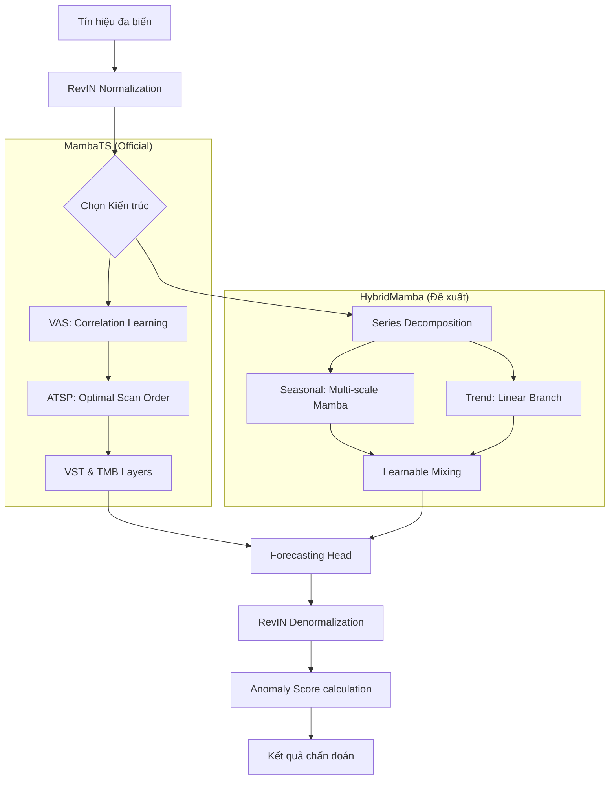

# Báo cáo Kỹ thuật Toàn diện: Hệ thống Chẩn đoán Lỗi Vòng bi dựa trên Kiến trúc Mamba cải tiến

## 1. Giới thiệu Dự án
Dự án tập trung vào việc xây dựng một hệ thống giám sát tình trạng (Condition Monitoring) và phát hiện bất thường cho vòng bi công nghiệp. Mục tiêu là phát hiện sớm các dấu hiệu suy giảm bề mặt từ dữ liệu rung động tần số cao, giúp ngăn ngừa hư hỏng thảm khốc.

**Dữ liệu sử dụng**: Dataset B02 (Giai đoạn suy giảm toàn vòng đời của vòng bi).
**GitHub Repository**: [mamba-forecast-ad](https://github.com/sunbv56/mamba-forecast-ad)

---

## 2. Quy trình Tổng quát (End-to-End Project Pipeline)

Quy trình từ dữ liệu thô đến khi ra báo cáo hiệu năng cuối cùng bao gồm 4 giai đoạn chính:

### Giai đoạn 1: Chuẩn bị và Tiền xử lý dữ liệu
- **Đọc dữ liệu thô**: Tải các file `.mat` từ bộ dữ liệu B02.
- **Chuyển đổi đơn vị**: Áp dụng hệ số 10 g/V để đưa tín hiệu về đơn vị gia tốc vật lý.
- **Phân tách dữ liệu (Chiến lược 10/50/40)**:
    - **Skip (10%)**: Loại bỏ giai đoạn chạy rà (break-in) ban đầu khi tín hiệu chưa ổn định.
    - **Train/Val (50%)**: Sử dụng dữ liệu khỏe mạnh để huấn luyện mô hình dự báo và tinh chỉnh ngưỡng.
    - **Test (40%)**: Đánh giá khả năng phát hiện lỗi trên dữ liệu suy giảm thực tế.

### Giai đoạn 2: Huấn luyện mô hình (Forecasting Task)
- **Mục tiêu**: Huấn luyện mô hình dự báo tín hiệu tương lai (Horizon) từ dữ liệu quá khứ (Lookback).
- **Loss Function**: Sử dụng **MSE** hoặc **Huber Loss** để cực tiểu hóa sai số dự báo trên tập lành mạnh.

### Giai đoạn 3: Hiệu chuẩn hệ thống phát hiện bất thường
- **Tính toán sai số**: Chạy mô hình trên tập Val để lấy phân phối sai số (Anomaly Scores).
- **Tối ưu hóa ngưỡng**: Sử dụng các mô hình thống kê (POT, Robust, hoặc 3-Sigma) để tìm ra ngưỡng cảnh báo tự động.

### Giai đoạn 4: Kiểm thử và Đánh giá
- **Inference**: Chạy mô hình trên tập Test và áp dụng ngưỡng để gán nhãn Bình thường/Bất thường.
- **Tính toán Metrics**: Đo lường F1, AUC, FAR và Độ trễ phát hiện (Delay).

---

## 3. Cấu trúc Dự án và Module hóa

Dự án được tổ chức theo cấu trúc module chuyên nghiệp để dễ dàng bảo trì và mở rộng:

```text
Mamba-Forecast-AD/
├── configs/          # Cấu hình YAML (mamba_ts.yaml, default.yaml)
├── src/              # Mã nguồn chính
│   ├── data/         # Dataset.py (Windowing, RMS Labeling), Pipeline.py
│   ├── models/       # MambaTS, HybridMamba, Baseline models
│   ├── training/     # Train.py, Trainer.py, Eval.py (Điểm bắt đầu thực thi chính)
│   ├── evaluation/   # Anomaly_scorer.py, Thresholding.py, Metrics.py
│   └── utils/        # Logger.py
├── scripts/          # Script tự động hóa (precompute_rms.py, run_pipeline.sh)
├── results/          # Models (.pth), Plots (.png), Logs
└── main.py / test.py # (Tạm thời không sử dụng)
```

---

## 4. Logic Tiền xử lý và Luồng Toán học (Mathematical Flow)

Để mô hình có thể học được các đặc trưng từ tín hiệu rung động phức tạp, các biến đổi toán học sau được áp dụng:

### 4.1. Phân mảnh cửa sổ (Sliding Window)
Với tín hiệu rung động $S \in \mathbb{R}^{C \times L_{total}}$, các cặp mẫu $(X, Y)$ được tạo ra:
- **Input (Lookback - Quá khứ)**: $X = S[:, t:t+L] \in \mathbb{R}^{C \times L}$
- **Target (Horizon - Tương lai)**: $Y = S[:, t+L:t+L+K] \in \mathbb{R}^{C \times K}$
- Trong đó $L=4096$ (Lookback) và $K=1024$ (Horizon) là các cấu hình mặc định giúp mô hình bao quát được các chu kỳ vòng quay của vòng bi.

### 4.2. Chuẩn hóa thích nghi (RevIN)
Để đối phó với sự dịch chuyển phân phối (distribution shift) do thay đổi tải trọng, mỗi cửa sổ $X$ được chuẩn hóa độc lập:
$$\mu_X = \frac{1}{L} \sum_{i=1}^L X_i, \quad \sigma_X = \sqrt{\frac{1}{L} \sum_{i=1}^L (X_i - \mu_X)^2 + \epsilon}$$
$$\hat{X} = \frac{X - \mu_X}{\sigma_X}$$
Các giá trị $\mu_X$ và $\sigma_X$ này sẽ được lưu lại để giải chuẩn hóa (denormalize) kết quả dự báo, giúp trả tín hiệu về đúng biên độ vật lý ban đầu.

---

## 5. Kiến trúc Mô hình (Architectures)

Hệ thống đã thực hiện đánh giá đối chứng qua 3 nhóm kiến trúc chính, tập trung vào khả năng xử lý chuỗi dài và tương quan biến:

### 5.1. Các mô hình Baseline (Cơ sở)
- **LSTM / TCN**: Các kiến trúc truyền thống. Tuy nhiên, tín hiệu rung động vòng bi thường có chu kỳ dài và tần số cao, khiến các mô hình này dễ bị mất thông tin hoặc bùng nổ gradient.
- **iTransformer**: Áp dụng Transformer trên chiều biến số. Mặc dù mạnh mẽ nhưng chi phí tính toán $O(L^2)$ vẫn là rào cản lớn.

### 5.2. MambaTS (Official Reference) - Cơ chế Selective SSM
Dựa trên paper gốc, MambaTS giải quyết bài toán đa biến bằng các kỹ thuật đột phá:
- **Patching**: Chia $\hat{X}$ thành $N$ mảnh kích thước $P$. $N = \lfloor \frac{L - P}{S} \rfloor + 1$.
- **Variable-Aware Scanning (VAS)**: 
    1. Tính ma trận tương quan Pearson $R \in \mathbb{R}^{C \times C}$ giữa các cảm biến.
    2. Sử dụng **ATSP Solver** để tìm thứ tự quét $\pi$ tối ưu, giúp mô hình học được dòng chảy thông tin tự nhiên nhất giữa các biến số.
- **VST (Variable Scan along Time)**: Sắp xếp các token theo thứ tự $(\text{Biến}_{\pi(1)}, \text{Patch}_{1\dots N}, \dots)$, biến bài toán đa biến thành một chuỗi dài duy nhất để Mamba xử lý.

### 5.3. HybridMamba (CI-Mamba++ - Giải pháp đề xuất)
Đây là kiến trúc được tinh chỉnh đặc biệt cho tín hiệu vật lý của vòng bi:
- **Series Decomposition**: Tách tín hiệu thành **Trend** (Xu hướng) và **Seasonal** (Dao động).
  $$X_{trend} = \text{AvgPool}(X), \quad X_{seasonal} = X - X_{trend}$$
- **Multi-Scale Patching**: Nhánh Seasonal sử dụng nhiều kích thước Patch cùng lúc để bắt được cả các xung động va đập cực ngắn và các dao động tuần hoàn dài hơn.
- **Learnable Mixing**: Kết quả dự báo cuối cùng $\hat{Y}$ được hòa trộn linh hoạt:
  $$\hat{Y} = \sigma(\alpha) \cdot \hat{Y}_{seasonal} + (1 - \sigma(\alpha)) \cdot \hat{Y}_{trend}$$
  Cơ chế này giúp mô hình vừa bám sát được sự gia tăng biên độ (như RMS) vừa dự báo chính xác các đỉnh xung động.

---

## 6. Logic Phát hiện Bất thường và Đánh giá

Quy trình biến các dự báo của mô hình thành quyết định chẩn đoán được thực hiện qua 3 bước:

### 6.1. Tính điểm bất thường (Anomaly Scoring)
Điểm bất thường $s$ cho mỗi cửa sổ là sai số bình phương trung bình (**MSE**) giữa tín hiệu thực tế $Y$ và dự báo $\hat{Y}$:
$$s = \frac{1}{C \cdot K} \sum_{c=1}^C \sum_{k=1}^K (Y_{c,k} - \hat{Y}_{c,k})^2$$
Trong một số kịch bản, Log-MSE ($s_{norm} = \ln(1+s)$) được áp dụng để nén dải động, giúp ổn định điểm số khi biên độ rung tăng quá cao ở giai đoạn cuối đời của vòng bi.

### 6.2. Các phương pháp xác định ngưỡng (Thresholding)
Hệ thống triển khai đa dạng các phương pháp để tìm ra ngưỡng $Threshold$ tối ưu:

- **3-Sigma**: Dựa trên phân phối chuẩn của sai số trong tập lành mạnh. $Threshold = \mu + 3\sigma$.
- **Robust (MAD)**: Sử dụng Trung vị sai số tuyệt đối, bền vững hơn trước các giá trị ngoại lai.
- **POT (Peak Over Threshold)**: Dựa trên **Lý thuyết Giá trị Cực trị (EVT)**. 
    1. Chọn một ngưỡng cơ sở $t$ (ví dụ: phân vị 98).
    2. Khớp phân phối Pareto tổng quát (GPD) cho các giá trị vượt ngưỡng $E = \{s_i - t \mid s_i > t\}$.
    3. Tính toán ngưỡng cuối cùng $z_q$ cho một xác suất biên cực thấp $q$ (ví dụ: $10^{-3}$):
       $$z_q = t + \frac{\sigma}{\gamma} \left( \left( \frac{n}{N_t} q \right)^{-\gamma} - 1 \right)$$

### 6.3. Các chỉ số hiệu năng (Metrics)
- **F1-Score**: Cân bằng giữa Precision (Độ chính xác) và Recall (Khả năng bắt lỗi).
- **FAR (False Alarm Rate)**: Tỷ lệ báo động sai trên vùng dữ liệu lành mạnh.
- **Detection Delay**: Độ trễ từ lúc lỗi xuất hiện vật lý (RMS vọt lên) đến khi mô hình phát hiện.

---

## 7. Kết quả Thực nghiệm và Trực quan hóa

### 7.1. Sơ đồ luồng dữ liệu (Data Flow)
Dưới đây là mô hình hóa luồng dữ liệu từ đầu vào đến kết quả chẩn đoán cuối cùng:



### 7.2. Hiệu năng thực tế (Mamba1-Hybrid)
Kết quả đánh giá trên tập Test của vòng bi B02 cho thấy hiệu năng vượt trội của mô hình HybridMamba:

| Phương pháp tính ngưỡng | F1-Score | FAR (Báo động giả) | Ngưỡng (Threshold) |
| :--- | :---: | :---: | :---: |
| 3-Sigma | 0.9822 | 0.0258 | 1.4104 |
| Robust | 0.9851 | 0.0215 | 1.6010 |
| Percentile (99.7) | 0.9852 | 0.0213 | 1.6171 |
| **POT (q=1e-3)** | **0.9859** | **0.0203** | **1.6928** |

- **Chỉ số AUPRC**: **0.9944** (Khả năng phân tách lỗi gần như tuyệt đối).
- **Tốc độ suy luận**: **0.0673 ms/mẫu** (Đã tối ưu hóa).

### 7.3. Phân tích xu hướng vật lý
Biểu đồ dưới đây so sánh điểm số bất thường của mô hình với các chỉ số vật lý thực tế:


**Nhận xét**:
- Điểm bất thường (Anomaly Score - đường màu đỏ) có sự tương quan cực kỳ chặt chẽ với **RMS** và **Kurtosis**.
- Khi vòng bi bắt đầu suy giảm (khoảng file thứ 335), mô hình phản ứng tức thì với sự nhảy vọt của điểm số bất thường, vượt xa ngưỡng cảnh báo.
- Giai đoạn cuối đời (End of Life), khi các chỉ số vật lý dao động mạnh, mô hình vẫn duy trì được điểm số bất thường ở mức cao, khẳng định tính ổn định trong việc chẩn đoán.

---

## 8. Kết luận và Ưu điểm vượt trội

Qua quá trình thực nghiệm và đối chứng, kiến trúc **HybridMamba (CI-Mamba++)** kết hợp với phương pháp tính ngưỡng **POT (q=1e-3)** đã chứng minh là giải pháp tối ưu nhất cho bài toán chẩn đoán lỗi vòng bi.

### 8.1. Ưu điểm vượt trội của HybridMamba
So với các phương pháp truyền thống (như BiMamba, LSTM) và MambaTS thuần túy, HybridMamba mang lại các lợi ích sau:
- **Tự động hóa hoàn toàn**: Không cần bước phân rã tín hiệu thủ công (như VMD/IMF), giúp tiết kiệm thời gian và tránh sai số do chủ quan con người.
- **Bám sát bản chất vật lý**: Nhờ nhánh Trend độc lập, mô hình phản ánh chính xác sự gia tăng năng lượng rung động khi lỗi phát triển, điều mà các mô hình dự báo thuần túy thường bỏ sót.
- **Độ chính xác và Tin cậy cao**: Đạt F1-Score **0.9859** và AUPRC gần như tuyệt đối (**0.9944**), đồng thời giảm thiểu tối đa báo động giả (FAR chỉ **2.03%**).
- **Khả năng triển khai thực tế**: Tốc độ suy luận siêu nhanh (**< 0.1ms**) cho phép hệ thống chạy trực tiếp trên các thiết bị giám sát tại hiện trường.

### 8.2. Khuyến nghị
- **Sử dụng HybridMamba** làm mô hình cốt lõi cho các hệ thống giám sát tình trạng (Condition Monitoring) cần độ nhạy cao và khả năng dự báo xu hướng dài hạn.
- **Áp dụng ngưỡng POT** với tham số $q=10^{-3}$ để đạt được sự cân bằng tốt nhất giữa việc phát hiện sớm và tránh báo động sai.

Hệ thống hiện tại không chỉ đạt độ chính xác kỹ thuật mà còn đảm bảo tính giải thích được về mặt cơ học, sẵn sàng cho việc ứng dụng rộng rãi trong các nhà máy thông minh.
